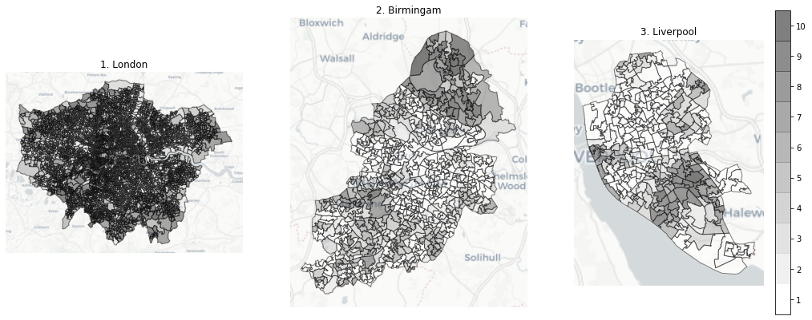
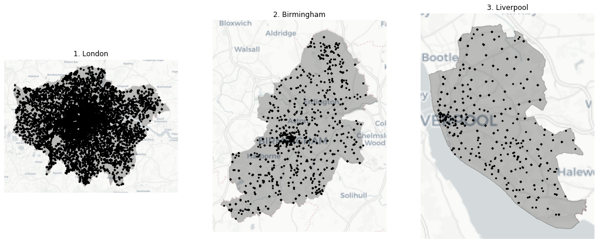
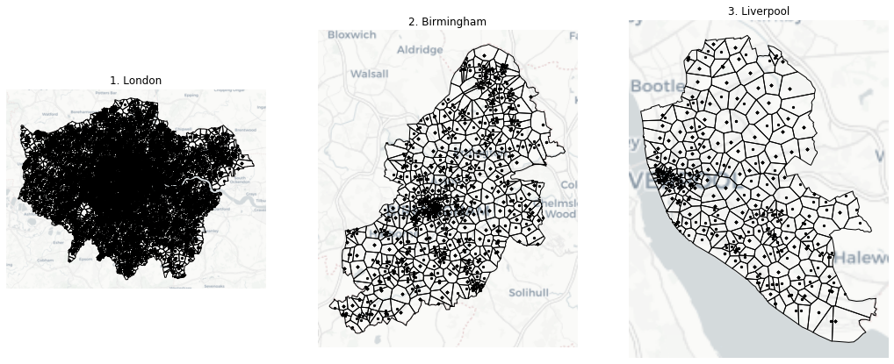
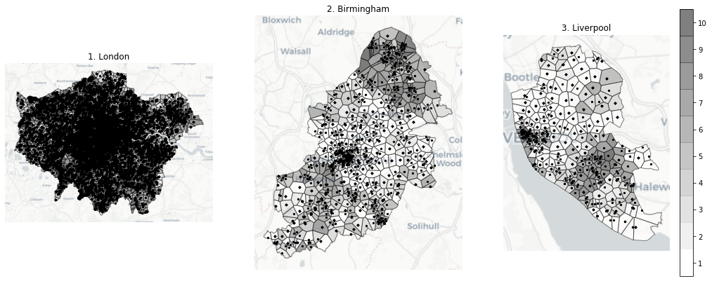

# Libraries


```python
import matplotlib.pyplot as plt
import numpy as np
import pandas as pd
import geopandas as gpd
from geopandas.tools import sjoin
import contextily as ctx
from shapely.ops import cascaded_union
# https://github.com/WZBSocialScienceCenter/geovoronoi
from geovoronoi import voronoi_regions_from_coords
from geovoronoi import points_to_coords
import seaborn as sns
```

# 1. Dataset preprocessing


```python
# from O2 Telefonica - originally in CRS EPSG:7405 - OSGB 1936 / British National Grid - Projected; .csv file
# I loaded the file to QGIS and saved it as geojson with EPSG4326-WGS84
telefonica_antenna_gpd_location = 'datasets/Telefonica_Antenna/telefonica_antenna_uk_EPSG4326-WGS84.geojson'
# from UK gov http://data-communities.opendata.arcgis.com/datasets/lower-super-output-area-lsoa-imd2019-wgs84
lsoa_2019_gpd_loc = 'datasets/UK_LSOA/Lower_Super_Output_Area_LSOA_IMD2019__WGS84.geojson'

telefonica_antenna_gpd = gpd.read_file(telefonica_antenna_gpd_location)
# there are 2414 antennas that do not have coordinates -> no geometry(None)
telefonica_antenna_gpd = telefonica_antenna_gpd[telefonica_antenna_gpd.geometry.type=='Point']
# filter columns that we will use
telefonica_antenna_gpd = telefonica_antenna_gpd[['generation','lkey','geometry']]
# either play with 3/4G or fill empty values with 'None' string
#telefonica_antenna_gpd = telefonica_antenna_gpd[(telefonica_antenna_gpd['generation']=='3G') | (telefonica_antenna_gpd['generation']=='4G')]
#telefonica_antenna_gpd = telefonica_antenna_gpd[telefonica_antenna_gpd['generation']=='4G']
telefonica_antenna_gpd.generation.fillna('None', inplace=True)
telefonica_antenna_gpd.drop_duplicates(['lkey'], keep='first', inplace=True)
lsoa_2019_gpd = gpd.read_file(lsoa_2019_gpd_loc)

# gpds have to be converted to epsg 3857 as that is the basemap coordinate system (background map in plots)
telefonica_antenna_gpd = telefonica_antenna_gpd.to_crs(epsg=3857)
lsoa_2019_gpd = lsoa_2019_gpd.to_crs(epsg=3857)
```


```python
# list of London boroughs from https://web.archive.org/web/20101010011530/http://londoncouncils.gov.uk/londonlocalgovernment/londonboroughs.htm
# list elements must end with space ' ' as there is Brent(London) and Brentwood(non-London) LSOA
london_counties = ['Camden ', 'City of London ', 'Hackney ', 'Hammersmith and Fulham ', 'Haringey ', 'Islington ', 'Kensington and Chelsea ', 'Lambeth ', 'Lewisham ', 'Newham ', 'Southwark ', 'Tower Hamlets ', 'Wandsworth ', 'Westminster ', 'Barking and Dagenham ', 'Barnet ', 'Bexley ', 'Brent ', 'Bromley ', 'Croydon ', 'Ealing ', 'Enfield ', 'Greenwich ', 'Harrow', 'Havering', 'Hillingdon ', 'Hounslow ', 'Kingston upon Thames ', 'Merton ', 'Redbridge ', 'Richmond upon Thames ', 'Sutton ', 'Waltham Forest ']
# https://en.wikipedia.org/wiki/Liverpool_Urban_Area vs metropolitan
#same for Birmingham
london_lsoa_2019_gpd = lsoa_2019_gpd[lsoa_2019_gpd['lsoa11nm'].str.match('|'.join(london_counties))][['IMDDecil','geometry']]
birmingham_lsoa_2019_gpd = lsoa_2019_gpd[lsoa_2019_gpd['lsoa11nm'].str.contains('Birmingham')][['IMDDecil','geometry']]
liverpool_lsoa_2019_gpd = lsoa_2019_gpd[lsoa_2019_gpd['lsoa11nm'].str.contains('Liverpool')][['IMDDecil','geometry']]

london_lsoa_2019_gpd.to_file('datasets/UK_LSOA/london_lsoa_2019_gpd.geojson', driver='GeoJSON')
birmingham_lsoa_2019_gpd.to_file('datasets/UK_LSOA/birmingham_lsoa_2019_gpd.geojson', driver='GeoJSON')
liverpool_lsoa_2019_gpd.to_file('datasets/UK_LSOA/liverpool_lsoa_2019_gpd.geojson', driver='GeoJSON')
```


```python
london_lsoa_2019_gpd = gpd.read_file('datasets/UK_LSOA/london_lsoa_2019_gpd.geojson')
birmingham_lsoa_2019_gpd = gpd.read_file('datasets/UK_LSOA/birmingham_lsoa_2019_gpd.geojson')
liverpool_lsoa_2019_gpd = gpd.read_file('datasets/UK_LSOA/liverpool_lsoa_2019_gpd.geojson')
```

# 2. UK LSOAs with IMD values for 3 largest cities


```python
def add_basemap(ax, zoom, url="http://a.basemaps.cartocdn.com/light_all/tileZ/tileX/tileY.png"):#url='http://tile.stamen.com/toner/tileZ/tileX/tileY.png'):
    xmin, xmax, ymin, ymax = ax.axis()
    basemap, extent = ctx.bounds2img(xmin, ymin, xmax, ymax, zoom=zoom, url=url)
    ax.imshow(basemap, extent=extent, interpolation='bilinear')
    # restore original x/y limits
    ax.axis((xmin, xmax, ymin, ymax))

#plot LSOAs with IMD deciles represented by shades of grey
fig, ax = plt.subplots(figsize=(18,10), facecolor='w', edgecolor='k')

ax = plt.subplot(1,3,1)
plt.title('1. London',fontsize=12)
LSOA_polygons = london_lsoa_2019_gpd.plot(ax=ax,alpha = 0.5, column='IMDDecil',cmap=plt.cm.get_cmap('binary', 10),edgecolor='black')
add_basemap(ax, zoom=10)
ax.set_axis_off()

ax = plt.subplot(1,3,2)
plt.title('2. Birmingam',fontsize=12)
LSOA_polygons = birmingham_lsoa_2019_gpd.plot(ax=ax,alpha = 0.5, column='IMDDecil',cmap=plt.cm.get_cmap('binary', 10),edgecolor='black')
add_basemap(ax, zoom=10)
ax.set_axis_off()

ax = plt.subplot(1,3,3)
plt.title('3. Liverpool',fontsize=12)
LSOA_polygons = liverpool_lsoa_2019_gpd.plot(ax=ax,alpha = 0.5, column='IMDDecil',cmap=plt.cm.get_cmap('binary', 10),edgecolor='black')
cbar = plt.colorbar(LSOA_polygons.collections[0], shrink=0.7, ticks=[1.45,2.35,3.25,4.15,5.05,5.95,6.85,7.75,8.65,9.55])
cbar.ax.set_yticklabels(['1','2','3','4','5','6','7','8','9','10'])
add_basemap(ax, zoom=10)
ax.set_axis_off()
```





# 3. O2 Telefonica antennas within LSOA boundaries


```python
# define boundaries of cities
london_lsoa_2019_boundary = gpd.GeoSeries(cascaded_union(london_lsoa_2019_gpd.buffer(0)))
birmingham_lsoa_2019_boundary = gpd.GeoSeries(cascaded_union(birmingham_lsoa_2019_gpd.buffer(0)))
liverpool_lsoa_2019_boundary = gpd.GeoSeries(cascaded_union(liverpool_lsoa_2019_gpd.buffer(0)))
# we have to create gpds for sjoin (spatial join)
london_lsoa_2019_boundary_gpd = gpd.GeoDataFrame(crs={'init': 'epsg:3857'},geometry=london_lsoa_2019_boundary)
birmingham_lsoa_2019_boundary_gpd = gpd.GeoDataFrame(crs={'init': 'epsg:3857'},geometry=birmingham_lsoa_2019_boundary)
liverpool_lsoa_2019_boundary_gpd = gpd.GeoDataFrame(crs={'init': 'epsg:3857'},geometry=liverpool_lsoa_2019_boundary)
```


```python
# geopandas sjoin is faster than other methods and direct geometry.intersects/within does not work as expected(does not iterate through whole dataset)
# new datafram contains unnecessary column 'index_right' pointing to only multipolygon in right dataset
telefonica_antenna_london_gpd = sjoin(telefonica_antenna_gpd,london_lsoa_2019_boundary_gpd, how='inner',op='intersects').drop(columns=['index_right']).reset_index(drop=True)
telefonica_antenna_birmingham_gpd = sjoin(telefonica_antenna_gpd,birmingham_lsoa_2019_boundary_gpd, how='inner',op='intersects').drop(columns=['index_right']).reset_index(drop=True)
telefonica_antenna_liverpool_gpd = sjoin(telefonica_antenna_gpd,liverpool_lsoa_2019_boundary_gpd, how='inner',op='intersects').drop(columns=['index_right']).reset_index(drop=True)

telefonica_antenna_london_gpd.to_file('datasets/Telefonica_Antenna/XG/telefonica_antenna_london_gpd.geojson', driver='GeoJSON')
telefonica_antenna_birmingham_gpd.to_file('datasets/Telefonica_Antenna/XG/telefonica_antenna_birmingham_gpd.geojson', driver='GeoJSON')
telefonica_antenna_liverpool_gpd.to_file('datasets/Telefonica_Antenna/XG/telefonica_antenna_liverpool_gpd.geojson', driver='GeoJSON')
```


```python
telefonica_antenna_london_gpd = gpd.read_file('datasets/Telefonica_Antenna/XG/telefonica_antenna_london_gpd.geojson')
telefonica_antenna_birmingham_gpd = gpd.read_file('datasets/Telefonica_Antenna/XG/telefonica_antenna_birmingham_gpd.geojson')
telefonica_antenna_liverpool_gpd = gpd.read_file('datasets/Telefonica_Antenna/XG/telefonica_antenna_liverpool_gpd.geojson')
```


```python
def add_basemap(ax, zoom, url="http://a.basemaps.cartocdn.com/light_all/tileZ/tileX/tileY.png"):#url='http://tile.stamen.com/toner/tileZ/tileX/tileY.png'):
    xmin, xmax, ymin, ymax = ax.axis()
    basemap, extent = ctx.bounds2img(xmin, ymin, xmax, ymax, zoom=zoom, url=url)
    ax.imshow(basemap, extent=extent, interpolation='bilinear')
    # restore original x/y limits
    ax.axis((xmin, xmax, ymin, ymax))

#plot LSOAs with IMD deciles represented by shades of grey
fig, ax = plt.subplots(figsize=(18,10), facecolor='w', edgecolor='k')

ax = plt.subplot(1,3,1)
plt.title('1. London',fontsize=12)
boundary = london_lsoa_2019_boundary_gpd.plot(ax=ax,alpha = 0.25, color='black')
points = telefonica_antenna_london_gpd.plot(ax=ax,alpha = 1, color='black',markersize=5)
add_basemap(ax, zoom=10)
ax.set_axis_off()

ax = plt.subplot(1,3,2)
plt.title('2. Birmingham',fontsize=12)
boundary = birmingham_lsoa_2019_boundary_gpd.plot(ax=ax,alpha = 0.25, color='black')
points = telefonica_antenna_birmingham_gpd.plot(ax=ax,alpha = 1, color='black',markersize=5)
add_basemap(ax, zoom=10)
ax.set_axis_off()

ax = plt.subplot(1,3,3)
plt.title('3. Liverpool',fontsize=12)
boundary = liverpool_lsoa_2019_boundary_gpd.plot(ax=ax,alpha = 0.25, color='black',edgecolor='black')
points = telefonica_antenna_liverpool_gpd.plot(ax=ax,alpha = 1, color='black',markersize=5)
add_basemap(ax, zoom=10)
ax.set_axis_off()
```





# 4. Antenna Voronoi tessellation


```python
# pieces from https://github.com/WZBSocialScienceCenter/geovoronoi
# I don't need extra information, only voronoi tesselation - I commented out lines 69-78 so I have only poly_shapes in return
# only unique coordinates -> faster computation

coords = np.unique(points_to_coords(telefonica_antenna_london_gpd.geometry), axis=0)
poly_shapes = voronoi_regions_from_coords(coords, london_lsoa_2019_boundary_gpd.geometry[0], shapes_from_diff_with_min_area=0.001)
telefonica_antenna_london_gpd_voronoi = gpd.GeoDataFrame(geometry=gpd.GeoSeries(poly_shapes))
telefonica_antenna_london_gpd_voronoi.to_file('datasets/Telefonica_Antenna/XG/telefonica_antenna_london_gpd_voronoi.geojson', driver='GeoJSON')

coords = np.unique(points_to_coords(telefonica_antenna_birmingham_gpd.geometry), axis=0)
poly_shapes = voronoi_regions_from_coords(coords, birmingham_lsoa_2019_boundary_gpd.geometry[0], shapes_from_diff_with_min_area=0.001)
telefonica_antenna_birmingham_gpd_voronoi = gpd.GeoDataFrame(geometry=gpd.GeoSeries(poly_shapes))
telefonica_antenna_birmingham_gpd_voronoi.to_file('datasets/Telefonica_Antenna/XG/telefonica_antenna_birmingham_gpd_voronoi.geojson', driver='GeoJSON')

coords = np.unique(points_to_coords(telefonica_antenna_liverpool_gpd.geometry), axis=0)
poly_shapes = voronoi_regions_from_coords(coords, liverpool_lsoa_2019_boundary_gpd.geometry[0], shapes_from_diff_with_min_area=0.001)
telefonica_antenna_liverpool_gpd_voronoi = gpd.GeoDataFrame(geometry=gpd.GeoSeries(poly_shapes))
telefonica_antenna_liverpool_gpd_voronoi.to_file('datasets/Telefonica_Antenna/XG/telefonica_antenna_liverpool_gpd_voronoi.geojson', driver='GeoJSON')
```


```python
telefonica_antenna_london_gpd_voronoi = gpd.read_file('datasets/Telefonica_Antenna/XG/telefonica_antenna_london_gpd_voronoi.geojson')
telefonica_antenna_birmingham_gpd_voronoi = gpd.read_file('datasets/Telefonica_Antenna/XG/telefonica_antenna_birmingham_gpd_voronoi.geojson')
telefonica_antenna_liverpool_gpd_voronoi = gpd.read_file('datasets/Telefonica_Antenna/XG/telefonica_antenna_liverpool_gpd_voronoi.geojson')
```


```python
def add_basemap(ax, zoom, url="http://a.basemaps.cartocdn.com/light_all/tileZ/tileX/tileY.png"):#url='http://tile.stamen.com/toner/tileZ/tileX/tileY.png'):
    xmin, xmax, ymin, ymax = ax.axis()
    basemap, extent = ctx.bounds2img(xmin, ymin, xmax, ymax, zoom=zoom, url=url)
    ax.imshow(basemap, extent=extent, interpolation='bilinear')
    # restore original x/y limits
    ax.axis((xmin, xmax, ymin, ymax))

#plot LSOAs with IMD deciles represented by shades of grey
fig, ax = plt.subplots(figsize=(18,10), facecolor='none', edgecolor='none')

ax = plt.subplot(1,3,1)
plt.title('1. London',fontsize=12)
boundaries = telefonica_antenna_london_gpd_voronoi.plot(ax=ax, alpha=1, color='none', edgecolor='black')
points = telefonica_antenna_london_gpd.plot(ax=ax,alpha = 1, color='black',markersize=5)
add_basemap(ax, zoom=10)
ax.set_axis_off()

ax = plt.subplot(1,3,2)
plt.title('2. Birmingham',fontsize=12)
boundaries = telefonica_antenna_birmingham_gpd_voronoi.plot(ax=ax, alpha=1, color='none', edgecolor='black')
points = telefonica_antenna_birmingham_gpd.plot(ax=ax,alpha = 1, color='black',markersize=5)
add_basemap(ax, zoom=10)
ax.set_axis_off()

ax = plt.subplot(1,3,3)
plt.title('3. Liverpool',fontsize=12)
boundaries = telefonica_antenna_liverpool_gpd_voronoi.plot(ax=ax, alpha=1, color='none', edgecolor='black')
points = telefonica_antenna_liverpool_gpd.plot(ax=ax,alpha = 1, color='black',markersize=5)
add_basemap(ax, zoom=10)
ax.set_axis_off()
```





# 5. Assignment of LSOA IMD value to Antenna Voronoi cells based on largest overlap between Voronoi cell and LSOA regions


```python
def get_size_of_intersection(row, right_gpd):
    return row['geometry'].intersection(right_gpd['geometry'].loc[int(row['index_right'])]).area

# 1. we do spatial join to get list of LSOAs that intersects voronoi cells
london_voronoi_vs_lsoa = sjoin(telefonica_antenna_london_gpd_voronoi, london_lsoa_2019_gpd, how='left',op='intersects')
birmingham_voronoi_vs_lsoa = sjoin(telefonica_antenna_birmingham_gpd_voronoi, birmingham_lsoa_2019_gpd, how='left',op='intersects')
liverpool_voronoi_vs_lsoa = sjoin(telefonica_antenna_liverpool_gpd_voronoi, liverpool_lsoa_2019_gpd, how='left',op='intersects')

# 1.1 we adjust the datasets
london_voronoi_vs_lsoa.reset_index(inplace=True)
london_voronoi_vs_lsoa.rename(columns={'index': 'id'}, inplace=True)
birmingham_voronoi_vs_lsoa.reset_index(inplace=True)
birmingham_voronoi_vs_lsoa.rename(columns={'index': 'id'}, inplace=True)
liverpool_voronoi_vs_lsoa.reset_index(inplace=True)
liverpool_voronoi_vs_lsoa.rename(columns={'index': 'id'}, inplace=True)

# 2. we compute interection sizes between voronoi cells and intersected LSOAs
london_voronoi_vs_lsoa['intersection_size'] = london_voronoi_vs_lsoa.apply(lambda row : get_size_of_intersection(row, london_lsoa_2019_gpd), axis=1)
birmingham_voronoi_vs_lsoa['intersection_size'] = birmingham_voronoi_vs_lsoa.apply(lambda row : get_size_of_intersection(row, birmingham_lsoa_2019_gpd), axis=1)
liverpool_voronoi_vs_lsoa['intersection_size'] = liverpool_voronoi_vs_lsoa.apply(lambda row : get_size_of_intersection(row, liverpool_lsoa_2019_gpd), axis=1)

# 3. we filter the max intersection size LSOAs and keep only the IMD decile
# there is no working/usable groupby geopandas at the  moment:
# 3.1 we sort values from high to low (descending)
# 3.2 unite tha values based on id(same for each polygon with same coordinates)
# 3.3 take the first, i.e. highest, intersection value
london_voronoi_vs_lsoa.sort_values(['id', 'intersection_size'], ascending=False, inplace=True)
london_voronoi_vs_lsoa = london_voronoi_vs_lsoa.dissolve('id')
london_voronoi_vs_lsoa.drop(columns=['index_right', 'intersection_size'], inplace=True)
birmingham_voronoi_vs_lsoa.sort_values(['id', 'intersection_size'], ascending=False, inplace=True)
birmingham_voronoi_vs_lsoa = birmingham_voronoi_vs_lsoa.dissolve('id')
birmingham_voronoi_vs_lsoa.drop(columns=['index_right', 'intersection_size'], inplace=True)
liverpool_voronoi_vs_lsoa.sort_values(['id', 'intersection_size'], ascending=False, inplace=True)
liverpool_voronoi_vs_lsoa = liverpool_voronoi_vs_lsoa.dissolve('id')
liverpool_voronoi_vs_lsoa.drop(columns=['index_right', 'intersection_size'], inplace=True)

london_voronoi_vs_lsoa.to_file('datasets/Telefonica_Antenna/XG/london_voronoi_vs_lsoa.geojson', driver='GeoJSON')
birmingham_voronoi_vs_lsoa.to_file('datasets/Telefonica_Antenna/XG/birmingham_voronoi_vs_lsoa.geojson', driver='GeoJSON')
liverpool_voronoi_vs_lsoa.to_file('datasets/Telefonica_Antenna/XG/liverpool_voronoi_vs_lsoa.geojson', driver='GeoJSON')
```


```python
london_voronoi_vs_lsoa = gpd.read_file('datasets/Telefonica_Antenna/XG/london_voronoi_vs_lsoa.geojson')
birmingham_voronoi_vs_lsoa = gpd.read_file('datasets/Telefonica_Antenna/XG/birmingham_voronoi_vs_lsoa.geojson')
liverpool_voronoi_vs_lsoa = gpd.read_file('datasets/Telefonica_Antenna/XG/liverpool_voronoi_vs_lsoa.geojson')
```


```python
def add_basemap(ax, zoom, url="http://a.basemaps.cartocdn.com/light_all/tileZ/tileX/tileY.png"):#url='http://tile.stamen.com/toner/tileZ/tileX/tileY.png'):
    xmin, xmax, ymin, ymax = ax.axis()
    basemap, extent = ctx.bounds2img(xmin, ymin, xmax, ymax, zoom=zoom, url=url)
    ax.imshow(basemap, extent=extent, interpolation='bilinear')
    # restore original x/y limits
    ax.axis((xmin, xmax, ymin, ymax))

#plot LSOAs with IMD deciles represented by shades of grey
fig, ax = plt.subplots(figsize=(18,10), facecolor='none', edgecolor='none')

ax = plt.subplot(1,3,1)
plt.title('1. London',fontsize=12)
voronoi_imd_polygons = london_voronoi_vs_lsoa.plot(ax=ax,alpha = 0.5, column='IMDDecil',cmap=plt.cm.get_cmap('binary', 10),edgecolor='black')
points = telefonica_antenna_london_gpd.plot(ax=ax,alpha = 1, color='black',markersize=5)
add_basemap(ax, zoom=10)
ax.set_axis_off()

ax = plt.subplot(1,3,2)
plt.title('2. Birmingham',fontsize=12)
voronoi_imd_polygons = birmingham_voronoi_vs_lsoa.plot(ax=ax,alpha = 0.5, column='IMDDecil',cmap=plt.cm.get_cmap('binary', 10),edgecolor='black')
points = telefonica_antenna_birmingham_gpd.plot(ax=ax,alpha = 1, color='black',markersize=5)
add_basemap(ax, zoom=10)
ax.set_axis_off()

ax = plt.subplot(1,3,3)
plt.title('3. Liverpool',fontsize=12)
voronoi_imd_polygons = liverpool_voronoi_vs_lsoa.plot(ax=ax,alpha = 0.5, column='IMDDecil',cmap=plt.cm.get_cmap('binary', 10),edgecolor='black')
cbar = plt.colorbar(voronoi_imd_polygons.collections[0], shrink=0.7, ticks=[1.45,2.35,3.25,4.15,5.05,5.95,6.85,7.75,8.65,9.55])
cbar.ax.set_yticklabels(['1','2','3','4','5','6','7','8','9','10'])
points = telefonica_antenna_liverpool_gpd.plot(ax=ax,alpha = 1, color='black',markersize=5)
add_basemap(ax, zoom=10)
ax.set_axis_off()
```





# 6. Assignment of LSOA IMD value from Antenna Voronoi cells to each antenna in dataset


```python
telefonica_antenna_london_imd_gpd = sjoin(telefonica_antenna_london_gpd, london_voronoi_vs_lsoa, how='left',op='intersects').drop(columns=['index_right'])
telefonica_antenna_birmingham_imd_gpd = sjoin(telefonica_antenna_birmingham_gpd, birmingham_voronoi_vs_lsoa, how='left',op='intersects').drop(columns=['index_right'])
telefonica_antenna_liverpool_imd_gpd = sjoin(telefonica_antenna_liverpool_gpd, liverpool_voronoi_vs_lsoa, how='left',op='intersects').drop(columns=['index_right'])

telefonica_antenna_london_imd_gpd.to_file('datasets/Telefonica_Antenna/XG/telefonica_antenna_london_imd_gpd.geojson', driver='GeoJSON')
telefonica_antenna_birmingham_imd_gpd.to_file('datasets/Telefonica_Antenna/XG/telefonica_antenna_birmingham_imd_gpd.geojson', driver='GeoJSON')
telefonica_antenna_liverpool_imd_gpd.to_file('datasets/Telefonica_Antenna/XG/telefonica_antenna_liverpool_imd_gpd.geojson', driver='GeoJSON')

telefonica_antenna_liverpool_imd_gpd.head()
```


<div>
<style scoped>
    .dataframe tbody tr th:only-of-type {
        vertical-align: middle;
    }

    .dataframe tbody tr th {
        vertical-align: top;
    }

    .dataframe thead th {
        text-align: right;
    }
</style>
<table border="1" class="dataframe">
  <thead>
    <tr style="text-align: right;">
      <th></th>
      <th>generation</th>
      <th>lkey</th>
      <th>geometry</th>
      <th>IMDDecil</th>
    </tr>
  </thead>
  <tbody>
    <tr>
      <th>0</th>
      <td>3G</td>
      <td>21438-17982</td>
      <td>POINT (-317951.7499682389 7049605.620724721)</td>
      <td>5</td>
    </tr>
    <tr>
      <th>1</th>
      <td>2G</td>
      <td>10826-150</td>
      <td>POINT (-317951.7499682389 7049605.620724721)</td>
      <td>5</td>
    </tr>
    <tr>
      <th>2</th>
      <td>2G</td>
      <td>20826-150</td>
      <td>POINT (-317951.7499682389 7049605.620724721)</td>
      <td>5</td>
    </tr>
    <tr>
      <th>3</th>
      <td>3G</td>
      <td>21438-11183</td>
      <td>POINT (-317951.7499682389 7049605.620724721)</td>
      <td>5</td>
    </tr>
    <tr>
      <th>4</th>
      <td>3G</td>
      <td>21438-21183</td>
      <td>POINT (-317951.7499682389 7049605.620724721)</td>
      <td>5</td>
    </tr>
  </tbody>
</table>
</div>


