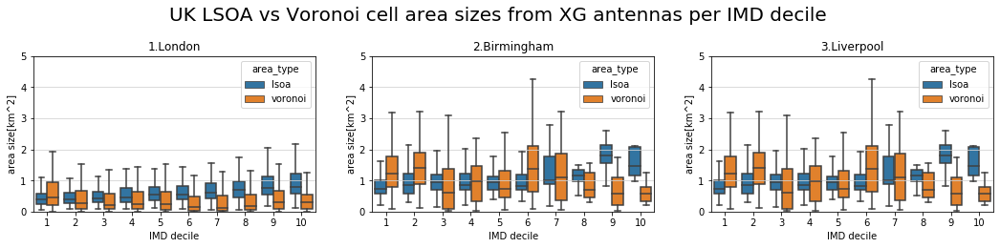
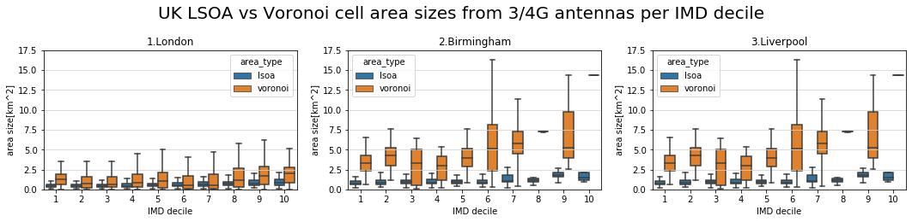
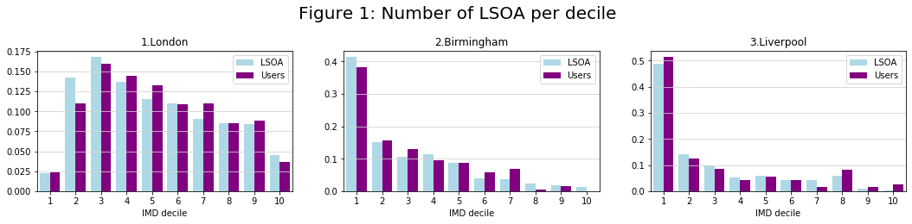
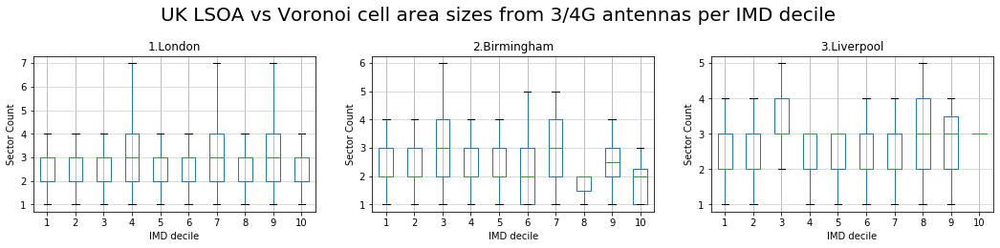
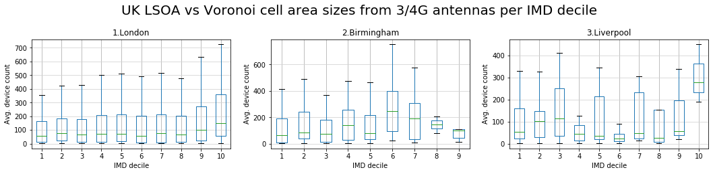

```python
import pandas as pd
import matplotlib.pyplot as plt
from matplotlib.lines import Line2D
from matplotlib.cm import get_cmap
import numpy as np
import geopandas as gpd
import seaborn as sns
from geopandas.tools import sjoin
```

# 1. LSOA areas vs Antenna Voronoi areas

NOTE:

Datasets are already in EPSG 3857: unit = metres, https://epsg.io/3857 <br>
Some systems use degrees as units and should not be used for area calculation, e.g. EPSG 4326 : https://epsg.io/4326


```python
london_lsoa_2019_gpd = gpd.read_file('datasets/UK_LSOA/london_lsoa_2019_gpd.geojson')
birmingham_lsoa_2019_gpd = gpd.read_file('datasets/UK_LSOA/birmingham_lsoa_2019_gpd.geojson')
liverpool_lsoa_2019_gpd = gpd.read_file('datasets/UK_LSOA/liverpool_lsoa_2019_gpd.geojson')

london_lsoa_2019_gpd['area_type'] = 'lsoa'
birmingham_lsoa_2019_gpd['area_type'] = 'lsoa'
liverpool_lsoa_2019_gpd['area_type'] = 'lsoa'
```

## 1.1 LSOA areas vs XG Antenna Voronoi areas


```python
london_voronoi_vs_lsoa = gpd.read_file('datasets/Telefonica_Antenna/XG/london_voronoi_vs_lsoa.geojson')
birmingham_voronoi_vs_lsoa = gpd.read_file('datasets/Telefonica_Antenna/XG/birmingham_voronoi_vs_lsoa.geojson')
liverpool_voronoi_vs_lsoa = gpd.read_file('datasets/Telefonica_Antenna/XG/liverpool_voronoi_vs_lsoa.geojson')

london_voronoi_vs_lsoa['area_type'] = 'voronoi'
birmingham_voronoi_vs_lsoa['area_type'] = 'voronoi'
liverpool_voronoi_vs_lsoa['area_type'] = 'voronoi'

london_areas = gpd.GeoDataFrame(pd.concat([london_lsoa_2019_gpd,london_voronoi_vs_lsoa], sort=False, ignore_index=True), crs=london_lsoa_2019_gpd.crs)
birmingham_areas = gpd.GeoDataFrame(pd.concat([birmingham_lsoa_2019_gpd,birmingham_voronoi_vs_lsoa], sort=False, ignore_index=True), crs=birmingham_lsoa_2019_gpd.crs)
liverpool_areas = gpd.GeoDataFrame(pd.concat([liverpool_lsoa_2019_gpd,liverpool_voronoi_vs_lsoa], sort=False, ignore_index=True), crs=liverpool_lsoa_2019_gpd.crs)

london_areas['area_size'] = london_areas['geometry'].area/ 10**6
birmingham_areas['area_size'] = birmingham_areas['geometry'].area/ 10**6
liverpool_areas['area_size'] = liverpool_areas['geometry'].area/ 10**6
```


```python
fig, ax = plt.subplots(1, 3, figsize=(18, 3), facecolor='w', edgecolor='k')
fig.suptitle('UK LSOA vs Voronoi cell area sizes from XG antennas per IMD decile', size=20, y=1.12)
def applyPlotStyle(ax):
    ax.yaxis.grid(True, linestyle='-', which='both', color='lightgrey')
    ax.set_ylim([0,5])
    ax.set_xlabel('IMD decile')
    ax.set_ylabel('area size[km^2]')

#london = sns.violinplot(ax = ax[0], x='IMDDecil', y='area_size', hue='area_type',scale='area', data=london_areas, split=True, showfliers=False)
london = sns.boxplot(ax = ax[0], x='IMDDecil', y='area_size', hue='area_type', data=london_areas, showfliers=False)
applyPlotStyle(ax[0])
ax[0].set_title('1.London')

#birmingham = sns.violinplot(ax=ax[1], x='IMDDecil', y='area_size', hue='area_type',scale='area', data=birmingham_areas, split=True, showfliers=False)
birmingham = sns.boxplot(ax=ax[1], x='IMDDecil', y='area_size', hue='area_type', data=birmingham_areas, showfliers=False)
applyPlotStyle(ax[1])
ax[1].set_title('2.Birmingham')

#liverpool = sns.violinplot(ax=ax[2], x='IMDDecil', y='area_size', hue='area_type',scale='area', data=birmingham_areas, split=True, showfliers=False)
liverpool = sns.boxplot(ax=ax[2], x='IMDDecil', y='area_size', hue='area_type', data=birmingham_areas, showfliers=False)
applyPlotStyle(ax[2])
ax[2].set_title('3.Liverpool')
```


    Text(0.5, 1.0, '3.Liverpool')





## 1.2 LSOA areas vs 3/4G Antenna Voronoi areas


```python
london_voronoi_vs_lsoa = gpd.read_file('datasets/Telefonica_Antenna/34G/london_voronoi_vs_lsoa.geojson')
birmingham_voronoi_vs_lsoa = gpd.read_file('datasets/Telefonica_Antenna/34G/birmingham_voronoi_vs_lsoa.geojson')
liverpool_voronoi_vs_lsoa = gpd.read_file('datasets/Telefonica_Antenna/34G/liverpool_voronoi_vs_lsoa.geojson')

london_voronoi_vs_lsoa['area_type'] = 'voronoi'
birmingham_voronoi_vs_lsoa['area_type'] = 'voronoi'
liverpool_voronoi_vs_lsoa['area_type'] = 'voronoi'

london_areas = gpd.GeoDataFrame(pd.concat([london_lsoa_2019_gpd,london_voronoi_vs_lsoa], sort=False, ignore_index=True), crs=london_lsoa_2019_gpd.crs)
birmingham_areas = gpd.GeoDataFrame(pd.concat([birmingham_lsoa_2019_gpd,birmingham_voronoi_vs_lsoa], sort=False, ignore_index=True), crs=birmingham_lsoa_2019_gpd.crs)
liverpool_areas = gpd.GeoDataFrame(pd.concat([liverpool_lsoa_2019_gpd,liverpool_voronoi_vs_lsoa], sort=False, ignore_index=True), crs=liverpool_lsoa_2019_gpd.crs)

london_areas['area_size'] = london_areas['geometry'].area/ 10**6
birmingham_areas['area_size'] = birmingham_areas['geometry'].area/ 10**6
liverpool_areas['area_size'] = liverpool_areas['geometry'].area/ 10**6
```


```python
fig, ax = plt.subplots(1, 3, figsize=(18, 3), facecolor='w', edgecolor='k')
fig.suptitle('UK LSOA vs Voronoi cell area sizes from 3/4G antennas per IMD decile', size=20, y=1.12)

def applyPlotStyle(ax):
    ax.yaxis.grid(True, linestyle='-', which='both', color='lightgrey')
    ax.set_ylim([0,17.5])
    ax.set_xlabel('IMD decile')
    ax.set_ylabel('area size[km^2]')
    
#london = sns.violinplot(ax = ax[0], x='IMDDecil', y='area_size', hue='area_type',scale='area', data=london_areas, split=True, showfliers=False)
london = sns.boxplot(ax = ax[0], x='IMDDecil', y='area_size', hue='area_type', data=london_areas, showfliers=False)
applyPlotStyle(ax[0])
ax[0].set_title('1.London')

#birmingham = sns.violinplot(ax=ax[1], x='IMDDecil', y='area_size', hue='area_type',scale='area', data=birmingham_areas, split=True, showfliers=False)
birmingham = sns.boxplot(ax=ax[1], x='IMDDecil', y='area_size', hue='area_type', data=birmingham_areas, showfliers=False)
applyPlotStyle(ax[1])
ax[1].set_title('2.Birmingham')

#liverpool = sns.violinplot(ax=ax[2], x='IMDDecil', y='area_size', hue='area_type',scale='area', data=birmingham_areas, split=True, showfliers=False)
liverpool = sns.boxplot(ax=ax[2], x='IMDDecil', y='area_size', hue='area_type', data=birmingham_areas, showfliers=False)
applyPlotStyle(ax[2])
ax[2].set_title('3.Liverpool')
```


    Text(0.5, 1.0, '3.Liverpool')





# 2. "Figure 1: Number of LSOAs per decile in London"


```python
london_lsoa_2019_gpd = gpd.read_file('datasets/UK_LSOA/london_lsoa_2019_gpd.geojson')
birmingham_lsoa_2019_gpd = gpd.read_file('datasets/UK_LSOA/birmingham_lsoa_2019_gpd.geojson')
liverpool_lsoa_2019_gpd = gpd.read_file('datasets/UK_LSOA/liverpool_lsoa_2019_gpd.geojson')

telefonica_antenna_london_imd_gpd = gpd.read_file('datasets/Telefonica_Antenna/34G/telefonica_antenna_london_imd_gpd.geojson', driver='GeoJSON')
telefonica_antenna_birmingham_imd_gpd = gpd.read_file('datasets/Telefonica_Antenna/34G/telefonica_antenna_birmingham_imd_gpd.geojson', driver='GeoJSON')
telefonica_antenna_liverpool_imd_gpd = gpd.read_file('datasets/Telefonica_Antenna/34G/telefonica_antenna_liverpool_imd_gpd.geojson', driver='GeoJSON')

homeantenna_birmingham_loc = 'datasets/HomeAntenna_Jan_2020/Birmingham/part-00000-8b70e381-5976-4d29-9431-6fed7cba105a-c000.csv'
homeantenna_liverpool_loc = 'datasets/HomeAntenna_Jan_2020/Liverpool/part-00000-31b6f85a-4fd4-42fa-b470-ce5b79d473ba-c000.csv'
homeantenna_london_loc = 'datasets/HomeAntenna_Jan_2020/London/part-00000-98ea76fa-3237-4fd3-a9c0-4e01e37b7bdf-c000.csv'
homeantenna_birmingham_pd = pd.read_csv(homeantenna_birmingham_loc, index_col=False)
homeantenna_liverpool_pd = pd.read_csv(homeantenna_liverpool_loc, index_col=False)
homeantenna_london_pd = pd.read_csv(homeantenna_london_loc, index_col=False)
```


```python
homeantenna_birmingham_pd = homeantenna_birmingham_pd.merge(telefonica_antenna_birmingham_imd_gpd, left_on='antenna_id', right_on='lkey', how='inner').drop(columns=['lkey', 'geometry']).reset_index(drop=True)
homeantenna_liverpool_pd = homeantenna_liverpool_pd.merge(telefonica_antenna_liverpool_imd_gpd, left_on='antenna_id', right_on='lkey', how='inner').drop(columns=['lkey', 'geometry']).reset_index(drop=True)
homeantenna_london_pd = homeantenna_london_pd.merge(telefonica_antenna_london_imd_gpd, left_on='antenna_id', right_on='lkey', how='inner').drop(columns=['lkey', 'geometry']).reset_index(drop=True)
```


```python
fig, ax = plt.subplots(1, 3, figsize=(18, 3), facecolor='w', edgecolor='k')
fig.suptitle('Figure 1: Number of LSOA per decile', size=20, y=1.12)

def applyPlotStyle(ax):
    ax.yaxis.grid(True, linestyle='-', which='both', color='lightgrey')
    #ax.set_ylim([0,17.5])
    ax.set_xlabel('IMD decile')
    ax.set_xlim([0.5,10.5])
    ax.set_xticks([1,2,3,4,5,6,7,8,9,10])
    ax.legend()
    
ax[0].hist([london_lsoa_2019_gpd['IMDDecil'],homeantenna_london_pd['IMDDecil']],color=['lightblue','purple'], bins=np.arange(12)-0.5, density=True,label=['LSOA', 'Users'])
applyPlotStyle(ax[0])
ax[0].set_title('1.London')

ax[1].hist([birmingham_lsoa_2019_gpd['IMDDecil'],homeantenna_birmingham_pd['IMDDecil']],color=['lightblue','purple'], bins=np.arange(12)-0.5, density=True,label=['LSOA', 'Users'])
applyPlotStyle(ax[1])
ax[1].set_title('2.Birmingham')

ax[2].hist([liverpool_lsoa_2019_gpd['IMDDecil'],homeantenna_liverpool_pd['IMDDecil']],color=['lightblue','purple'], bins=np.arange(12)-0.5, density=True,label=['LSOA', 'Users'])
applyPlotStyle(ax[2])
ax[2].set_title('3.Liverpool')
```


    Text(0.5, 1.0, '3.Liverpool')





# 3. "Figure 3: Aggregated sector level analysis"

## 3.1 "(a) Distribution of number of sectors per LSOA."


```python
london_lsoa_2019_gpd = gpd.read_file('datasets/UK_LSOA/london_lsoa_2019_gpd.geojson')
birmingham_lsoa_2019_gpd = gpd.read_file('datasets/UK_LSOA/birmingham_lsoa_2019_gpd.geojson')
liverpool_lsoa_2019_gpd = gpd.read_file('datasets/UK_LSOA/liverpool_lsoa_2019_gpd.geojson')

telefonica_antenna_london_gpd_voronoi = gpd.read_file('datasets/Telefonica_Antenna/4G/telefonica_antenna_london_gpd_voronoi.geojson')
telefonica_antenna_birmingham_gpd_voronoi = gpd.read_file('datasets/Telefonica_Antenna/4G/telefonica_antenna_birmingham_gpd_voronoi.geojson')
telefonica_antenna_liverpool_gpd_voronoi = gpd.read_file('datasets/Telefonica_Antenna/4G/telefonica_antenna_liverpool_gpd_voronoi.geojson')
```


```python
# count intersection of 4G Antennas voronoi cells with LSOAs
london_4G_AntVor_x_LSOA_count = sjoin(london_lsoa_2019_gpd,telefonica_antenna_london_gpd_voronoi, how='left',op='intersects').reset_index()
london_4G_AntVor_x_LSOA_count = london_4G_AntVor_x_LSOA_count.groupby(['index','IMDDecil'], as_index=False).count().drop(columns=['index','geometry']).rename(columns={'index_right': '4G_antenna_count'})

birmingham_4G_AntVor_x_LSOA_count = sjoin(birmingham_lsoa_2019_gpd,telefonica_antenna_birmingham_gpd_voronoi, how='left',op='intersects').reset_index()
birmingham_4G_AntVor_x_LSOA_count = birmingham_4G_AntVor_x_LSOA_count.groupby(['index','IMDDecil'], as_index=False).count().drop(columns=['index','geometry']).rename(columns={'index_right': '4G_antenna_count'})

liverpool_4G_AntVor_x_LSOA_count = sjoin(liverpool_lsoa_2019_gpd,telefonica_antenna_liverpool_gpd_voronoi, how='left',op='intersects').reset_index()
liverpool_4G_AntVor_x_LSOA_count = liverpool_4G_AntVor_x_LSOA_count.groupby(['index','IMDDecil'], as_index=False).count().drop(columns=['index','geometry']).rename(columns={'index_right': '4G_antenna_count'})
```

    C:\ProgramData\Anaconda3\lib\site-packages\geopandas\tools\sjoin.py:56: UserWarning: CRS of frames being joined does not match!({'init': 'epsg:3857'} != {'init': 'epsg:4326'})
      '(%s != %s)' % (left_df.crs, right_df.crs))
    


```python
fig, ax = plt.subplots(1, 3, figsize=(18, 3), facecolor='w', edgecolor='k')
fig.suptitle('Figure 3a Distribution of number of sectors per LSOA', size=20, y=1.12)

def applyPlotStyle(ax):
    ax.yaxis.grid(True, linestyle='-', which='both', color='lightgrey')
    #ax.set_ylim([0,17.5])
    ax.set_xlabel('IMD decile')
    ax.set_ylabel('Sector Count')
    
london_4G_AntVor_x_LSOA_count.pivot(columns='IMDDecil', values='4G_antenna_count').boxplot(showfliers =False,ax=ax[0])
applyPlotStyle(ax[0])
ax[0].set_title('1.London')

birmingham_4G_AntVor_x_LSOA_count.pivot(columns='IMDDecil', values='4G_antenna_count').boxplot(showfliers =False,ax=ax[1])
applyPlotStyle(ax[1])
ax[1].set_title('2.Birmingham')

liverpool_4G_AntVor_x_LSOA_count.pivot(columns='IMDDecil', values='4G_antenna_count').boxplot(showfliers =False,ax=ax[2])
applyPlotStyle(ax[2])
ax[2].set_title('3.Liverpool')
```


    Text(0.5, 1.0, '3.Liverpool')





## 3.2 "(b) Distribution of number of residents’ devices served by sectors"


```python
telefonica_antenna_london_imd_gpd = gpd.read_file('datasets/Telefonica_Antenna/34G/telefonica_antenna_london_imd_gpd.geojson', driver='GeoJSON')
telefonica_antenna_birmingham_imd_gpd = gpd.read_file('datasets/Telefonica_Antenna/34G/telefonica_antenna_birmingham_imd_gpd.geojson', driver='GeoJSON')
telefonica_antenna_liverpool_imd_gpd = gpd.read_file('datasets/Telefonica_Antenna/34G/telefonica_antenna_liverpool_imd_gpd.geojson', driver='GeoJSON')

homeantenna_birmingham_loc = 'datasets/HomeAntenna_Jan_2020/Birmingham/part-00000-8b70e381-5976-4d29-9431-6fed7cba105a-c000.csv'
homeantenna_liverpool_loc = 'datasets/HomeAntenna_Jan_2020/Liverpool/part-00000-31b6f85a-4fd4-42fa-b470-ce5b79d473ba-c000.csv'
homeantenna_london_loc = 'datasets/HomeAntenna_Jan_2020/London/part-00000-98ea76fa-3237-4fd3-a9c0-4e01e37b7bdf-c000.csv'
homeantenna_birmingham_pd = pd.read_csv(homeantenna_birmingham_loc, index_col=False)
homeantenna_liverpool_pd = pd.read_csv(homeantenna_liverpool_loc, index_col=False)
homeantenna_london_pd = pd.read_csv(homeantenna_london_loc, index_col=False)
```


```python
homeantenna_birmingham_pd = homeantenna_birmingham_pd.merge(telefonica_antenna_birmingham_imd_gpd, left_on='antenna_id', right_on='lkey', how='inner').drop(columns=['lkey', 'geometry']).reset_index(drop=True)
homeantenna_liverpool_pd = homeantenna_liverpool_pd.merge(telefonica_antenna_liverpool_imd_gpd, left_on='antenna_id', right_on='lkey', how='inner').drop(columns=['lkey', 'geometry']).reset_index(drop=True)
homeantenna_london_pd = homeantenna_london_pd.merge(telefonica_antenna_london_imd_gpd, left_on='antenna_id', right_on='lkey', how='inner').drop(columns=['lkey', 'geometry']).reset_index(drop=True)
```


```python
birmingham_4G_res_count = homeantenna_birmingham_pd[homeantenna_birmingham_pd['generation']=='4G'].groupby(['antenna_id','IMDDecil'], as_index=False).count().drop(columns=['antenna_id','generation']).rename(columns={'device_id': '4G_res_count'})
liverpool_4G_res_count = homeantenna_liverpool_pd[homeantenna_liverpool_pd['generation']=='4G'].groupby(['antenna_id','IMDDecil'], as_index=False).count().drop(columns=['antenna_id','generation']).rename(columns={'device_id': '4G_res_count'})
london_4G_res_count = homeantenna_london_pd[homeantenna_london_pd['generation']=='4G'].groupby(['antenna_id','IMDDecil'], as_index=False).count().drop(columns=['antenna_id','generation']).rename(columns={'device_id': '4G_res_count'})
```


```python
fig, ax = plt.subplots(1, 3, figsize=(18, 3), facecolor='w', edgecolor='k')
fig.suptitle('Fig 3b Distribution of number of residents’ devices served by sectors', size=20, y=1.12)

def applyPlotStyle(ax):
    ax.yaxis.grid(True, linestyle='-', which='both', color='lightgrey')
    #ax.set_ylim([0,17.5])
    ax.set_xlabel('IMD decile')
    ax.set_ylabel('Avg. device count')
    
london_4G_res_count.pivot(columns='IMDDecil', values='4G_res_count').boxplot(showfliers =False,ax=ax[0])
applyPlotStyle(ax[0])
ax[0].set_title('1.London')

birmingham_4G_res_count.pivot(columns='IMDDecil', values='4G_res_count').boxplot(showfliers =False,ax=ax[1])
applyPlotStyle(ax[1])
ax[1].set_title('2.Birmingham')

liverpool_4G_res_count.pivot(columns='IMDDecil', values='4G_res_count').boxplot(showfliers =False,ax=ax[2])
applyPlotStyle(ax[2])
ax[2].set_title('3.Liverpool')
```


    Text(0.5, 1.0, '3.Liverpool')




