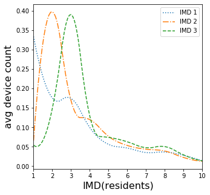
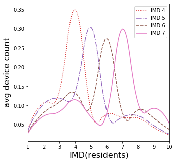
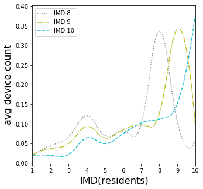
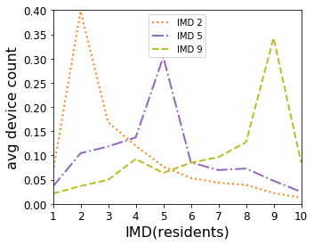

# Antenna Average Device Count distribution of residents by their home IMD decile per antenna IMD decile


```python
import pandas as pd
import matplotlib.pyplot as plt
from matplotlib.lines import Line2D
from matplotlib.cm import get_cmap
import numpy as np
```


```python
antenna_dt_pd_ml_scaled_loc = 'AntennaMLDataset_FebMar_df.csv'
antenna_dt_pd_ml_scaled_df = pd.read_csv(antenna_dt_pd_ml_scaled_loc, index_col=False)
# set global font size for tick labels
plt.rc('xtick',labelsize=12)
plt.rc('ytick',labelsize=12)
```


```python
from scipy.interpolate import interp1d

fig, ax= plt.subplots(1, 1, figsize=(5, 4))

columns_dev = [ '1_imd_avgdevcnt', '2_imd_avgdevcnt', '3_imd_avgdevcnt', '4_imd_avgdevcnt', '5_imd_avgdevcnt', '6_imd_avgdevcnt', '7_imd_avgdevcnt', '8_imd_avgdevcnt', '9_imd_avgdevcnt', '10_imd_avgdevcnt']
for imd,line_s in zip([1,2,3],[':','-.','--']):
    x = range(10)
    y = antenna_dt_pd_ml_scaled_df[antenna_dt_pd_ml_scaled_df['LSOA_IMD_decile']==imd][columns_dev].mean().values/sum(antenna_dt_pd_ml_scaled_df[antenna_dt_pd_ml_scaled_df['LSOA_IMD_decile']==imd][columns_dev].mean().values)
    ax.plot(x,y,color=colors[imd-1],linestyle=line_s,label= 'IMD '+str(imd),linewidth=2.0)
ax.set_xlabel('IMD(residents)', size=16)
ax.set_ylabel('avg device count', size=16)
ax.set_xlim([0,9])
ax.set_ylim([0,0.4])
ax.set_xticks(range(10))
ax.set_xticklabels(range(1,11))

ax.legend(loc='upper right',fontsize=10)
fig.savefig('distr_of_avg_dev_cnt_per_antenna_lsoa_imd_1-3.pdf', dpi=None, facecolor='w', edgecolor='w',format='pdf',transparent=False, bbox_inches=None, pad_inches=0,frameon=None)
```

    C:\ProgramData\Anaconda3\lib\site-packages\ipykernel_launcher.py:18: MatplotlibDeprecationWarning: 
    The frameon kwarg was deprecated in Matplotlib 3.1 and will be removed in 3.3. Use facecolor instead.
    





```python
cmap = get_cmap('tab10')
colors = cmap.colors

fig, ax= plt.subplots(1, 1, figsize=(5, 4))
#fig.suptitle('Distribution of average Device count per Antenna LSOA IMD', size=20)

columns_dev = [ '1_imd_avgdevcnt', '2_imd_avgdevcnt', '3_imd_avgdevcnt', '4_imd_avgdevcnt', '5_imd_avgdevcnt', '6_imd_avgdevcnt', '7_imd_avgdevcnt', '8_imd_avgdevcnt', '9_imd_avgdevcnt', '10_imd_avgdevcnt']
for imd,line_s in zip([4,5,6,7],[':','-.','--','-']):
    x = range(10)
    y = antenna_dt_pd_ml_scaled_df[antenna_dt_pd_ml_scaled_df['LSOA_IMD_decile']==imd][columns_dev].mean().values/sum(antenna_dt_pd_ml_scaled_df[antenna_dt_pd_ml_scaled_df['LSOA_IMD_decile']==imd][columns_dev].mean().values)
    ax.plot(x,y,color=colors[imd-1],linestyle=line_s,label= 'IMD '+str(imd),linewidth=2.0)
ax.set_xlabel('IMD(residents)', size=16)
ax.set_ylabel('avg device count', size=16)
ax.set_xlim([0,9])
ax.set_ylim([0,0.4])
ax.set_xticks(range(10))
ax.set_xticklabels(range(1,11))

ax.legend(loc='upper right',fontsize=10)
fig.savefig('distr_of_avg_dev_cnt_per_antenna_lsoa_imd_4-7.pdf', dpi=None, facecolor='w', edgecolor='w',format='pdf',transparent=False, bbox_inches=None, pad_inches=0,frameon=None)
```

    C:\ProgramData\Anaconda3\lib\site-packages\ipykernel_launcher.py:20: MatplotlibDeprecationWarning: 
    The frameon kwarg was deprecated in Matplotlib 3.1 and will be removed in 3.3. Use facecolor instead.
    





```python
import matplotlib.pyplot as plt
from matplotlib.lines import Line2D

fig, ax= plt.subplots(1, 1, figsize=(5, 4))
#fig.suptitle('Distribution of average Device count per Antenna LSOA IMD', size=20)

columns_dev = [ '1_imd_avgdevcnt', '2_imd_avgdevcnt', '3_imd_avgdevcnt', '4_imd_avgdevcnt', '5_imd_avgdevcnt', '6_imd_avgdevcnt', '7_imd_avgdevcnt', '8_imd_avgdevcnt', '9_imd_avgdevcnt', '10_imd_avgdevcnt']
for imd,line_s in zip([8,9,10],[':','-.','--']):
    x = range(10)
    y = antenna_dt_pd_ml_scaled_df[antenna_dt_pd_ml_scaled_df['LSOA_IMD_decile']==imd][columns_dev].mean().values/sum(antenna_dt_pd_ml_scaled_df[antenna_dt_pd_ml_scaled_df['LSOA_IMD_decile']==imd][columns_dev].mean().values)
    ax.plot(x,y,color=colors[imd-1],linestyle=line_s,label= 'IMD '+str(imd),linewidth=2.0)
ax.set_xlabel('IMD(residents)', size=16)
ax.set_ylabel('avg device count', size=16)
ax.set_xlim([0,9])
ax.set_ylim([0,0.4])
ax.set_xticks(range(10))
ax.set_xticklabels(range(1,11))

ax.legend(loc='upper left',fontsize=10)
fig.savefig('distr_of_avg_dev_cnt_per_antenna_lsoa_imd_8-10.pdf', dpi=None, facecolor='w', edgecolor='w',format='pdf',transparent=False, bbox_inches=None, pad_inches=0,frameon=None)
```

    C:\ProgramData\Anaconda3\lib\site-packages\ipykernel_launcher.py:20: MatplotlibDeprecationWarning: 
    The frameon kwarg was deprecated in Matplotlib 3.1 and will be removed in 3.3. Use facecolor instead.
    





```python
import matplotlib.pyplot as plt
from matplotlib.lines import Line2D

fig, ax= plt.subplots(1, 1, figsize=(5, 4))
#fig.suptitle('Distribution of average Device count per Antenna LSOA IMD', size=20)

columns_dev = [ '1_imd_avgdevcnt', '2_imd_avgdevcnt', '3_imd_avgdevcnt', '4_imd_avgdevcnt', '5_imd_avgdevcnt', '6_imd_avgdevcnt', '7_imd_avgdevcnt', '8_imd_avgdevcnt', '9_imd_avgdevcnt', '10_imd_avgdevcnt']
for imd,line_s in zip([2,5,9],[':','-.','--']):
    x = range(10)
    y = antenna_dt_pd_ml_scaled_df[antenna_dt_pd_ml_scaled_df['LSOA_IMD_decile']==imd][columns_dev].mean().values/sum(antenna_dt_pd_ml_scaled_df[antenna_dt_pd_ml_scaled_df['LSOA_IMD_decile']==imd][columns_dev].mean().values)
    # interpolation for nicer plot
    #f = interp1d(x, y, kind='quadratic')
    #xp = np.linspace(0, 9, 100, endpoint=True)
    #ax.plot(xp,f(xp),color=colors[imd-1],linestyle=line_s,label= 'IMD '+str(imd))
    ax.plot(x,y,color=colors[imd-1],linestyle=line_s,label= 'IMD '+str(imd),linewidth=2.0)
ax.set_xlabel('IMD(residents)', size=16)
ax.set_ylabel('avg device count', size=16)
ax.set_xlim([0,9])
ax.set_ylim([0,0.4])
ax.set_xticks(range(10))
ax.set_xticklabels(range(1,11))

ax.legend(loc='upper center',fontsize=10)
fig.savefig('distr_of_avg_dev_cnt_per_antenna_lsoa_imd_2-5-9.pdf', dpi=None, facecolor='w', edgecolor='w',format='pdf',transparent=False, bbox_inches=None, pad_inches=0,frameon=None)
```

    C:\ProgramData\Anaconda3\lib\site-packages\ipykernel_launcher.py:24: MatplotlibDeprecationWarning: 
    The frameon kwarg was deprecated in Matplotlib 3.1 and will be removed in 3.3. Use facecolor instead.
    




