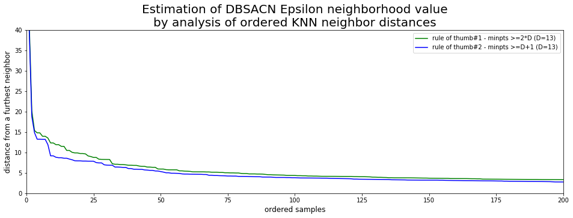
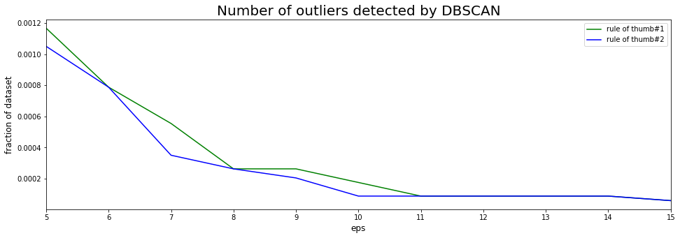

# Antenna outlier detection

## Libraries and datasets location


```python
# define libraries
import pandas as pd
import numpy as np
import matplotlib.pyplot as plt
import sklearn
from sklearn.preprocessing import StandardScaler
from sklearn.neighbors import NearestNeighbors
from sklearn.cluster import DBSCAN
%matplotlib inline
```

## Filter out antenna sector features


```python
antenna_feature_subset_sector = ['weighted_pktloss_perc50', 'weighted_pktloss_perc10', 'weighted_pktloss_perc90',\
                                 'weighted_pktloss', 'weighted_pktretransrate_perc50', 'weighted_pktretransrate_perc10',\
                                 'weighted_pktretransrate_perc90', 'weighted_pktretransrate', 'weighted_latency_perc50',\
                                 'weighted_latency_perc10', 'weighted_latency_perc90', 'weighted_latency', 'weighted_total_volume']

# define datasets
antenna_dt_pd_ml_scaled_loc = 'antenna_dt_pd_ml_scaled.csv'

# drop rows with empty values
antenna_dt_pd_ml_scaled = pd.read_csv(antenna_dt_pd_ml_scaled_loc, index_col=False)
antenna_dt_pd_ml_scaled = antenna_dt_pd_ml_scaled[antenna_feature_subset_sector]
```

# Estimation of DBSACN Epsilon neighborhood value by analysis of ordered KNN neighbor distances


```python
# rule of thumb 1 - minpts >=2*D ; number_of_neighbors = minpts-1 -> 2*D-1
n_nbrs1 = 2*len(antenna_dt_pd_ml_scaled.columns.values) - 1
nbrs1 = NearestNeighbors(n_neighbors=n_nbrs1).fit(antenna_dt_pd_ml_scaled.values)
distances1, indices1 = nbrs1.kneighbors(antenna_dt_pd_ml_scaled.values)
# rule of thumb 2 : minpts >= D+1 ; number_of_neighbors = minpts-1 -> D
n_nbrs2 = len(antenna_dt_pd_ml_scaled.columns.values)
nbrs2 = NearestNeighbors(n_neighbors=n_nbrs2).fit(antenna_dt_pd_ml_scaled.values)
distances2, indices2 = nbrs2.kneighbors(antenna_dt_pd_ml_scaled.values)
```


```python
fig, ax = plt.subplots(1, 1, figsize=(16, 5))
ax.set_title('Estimation of DBSACN Epsilon neighborhood value\nby analysis of ordered KNN neighbor distances',size=20)
ax.plot(np.sort(distances1[:,n_nbrs1-1])[::-1],color='green')
ax.plot(np.sort(distances2[:,n_nbrs2-1])[::-1],color='blue')
ax.set_xlabel('ordered samples',size=12)
ax.set_ylabel('distance from a furthest neighbor',size=12)
ax.set_xlim([0,200])
ax.set_ylim([0,40])
ax.legend(['rule of thumb#1 - minpts >=2*D (D=' + str(len(antenna_dt_pd_ml_scaled.columns)) + ')'\
           ,'rule of thumb#2 - minpts >=D+1 (D=' + str(len(antenna_dt_pd_ml_scaled.columns)) + ')'])

print('Start/end of the elbow in rule#1 is in 5/15 : p99/p99.99\nStart/end of the elbow in rule#2 approx. same')
#np.percentile(distances1,99.99)
#np.percentile(distances1,99.9)
```

    Start/end of the elbow in rule#1 is in 5/15 : p99/p99.99
    Start/end of the elbow in rule#2 approx. same





# DBSCAN outlier detection
## DBSCAN computation for range of Epsilon values


```python
dbscan_results_list = list()
temp = list()
eps_list = [5,6,7,8,9,10,11,12,13,14,15]
min_samples_list = [26,14]
for min_samples in min_samples_list[:2]:
    for eps in eps_list:
        temp = list()
        dbscan_clusterer = DBSCAN(eps=eps, min_samples=min_samples).fit(antenna_dt_pd_ml_scaled.values)
        temp.append(str(eps))
        temp.append(str(min_samples))
        temp.append(dbscan_clusterer.labels_)
        dbscan_results_list.append(temp)
dbscan_results_pd = pd.DataFrame(dbscan_results_list, columns=['eps','min_samples','labels'])
```


```python
# maybe there is a better way how to put arrays ('outliers') into pandas cells...
temp_clusters = list()
temp_num_outliers = list()
temp_outliers = list()

for labels in dbscan_results_pd['labels']:
    temp_clusters.append(len(np.unique(labels)))
    temp_num_outliers.append(len(np.where(labels == -1)[0]))
    temp_outliers.append(np.where(labels == -1)[0])
    
dbscan_results_pd['#clusters'] = temp_clusters
dbscan_results_pd['#outliers'] = temp_num_outliers
dbscan_results_pd['outliers'] = temp_outliers
```


```python
# have to be saved as pickle as there are arrays in column 'labels' - pure csv will fuck it up
#dbscan_results_pd.to_pickle('dbscan_results_antenna_dt_pd_ml_scaled.csv')
dbscan_results_pd = pd.read_pickle('dbscan_results_antenna_dt_pd_ml_scaled.csv')
```

## DBSCAN results evaluation


```python
fig, ax = plt.subplots(1, 1, figsize=(16, 5))
ax.set_title('Number of outliers detected by DBSCAN',size=20)
ax.plot(dbscan_results_pd[dbscan_results_pd['min_samples']=='26']['eps'], dbscan_results_pd[dbscan_results_pd['min_samples']=='26']['#outliers']/len(dbscan_results_pd['labels'][0]),color='green')
ax.plot(dbscan_results_pd[dbscan_results_pd['min_samples']=='14']['eps'], dbscan_results_pd[dbscan_results_pd['min_samples']=='14']['#outliers']/len(dbscan_results_pd['labels'][0]),color='blue')
ax.set_xlabel('eps',size=12)
ax.set_ylabel('fraction of dataset',size=12)
ax.set_xlim([0,10])
handles, labels = ax.get_legend_handles_labels()
ax.legend(handles,['rule of thumb#1','rule of thumb#2'])
```


    <matplotlib.legend.Legend at 0x7f2c445fb1d0>





```python
dbscan_results_pd
```


<div>
<style scoped>
    .dataframe tbody tr th:only-of-type {
        vertical-align: middle;
    }

    .dataframe tbody tr th {
        vertical-align: top;
    }

    .dataframe thead th {
        text-align: right;
    }
</style>
<table border="1" class="dataframe">
  <thead>
    <tr style="text-align: right;">
      <th></th>
      <th>eps</th>
      <th>min_samples</th>
      <th>labels</th>
      <th>#clusters</th>
      <th>#outliers</th>
      <th>outliers</th>
    </tr>
  </thead>
  <tbody>
    <tr>
      <th>0</th>
      <td>5</td>
      <td>26</td>
      <td>[0, 0, 0, 0, 0, 0, 0, 0, 0, 0, 0, 0, 0, 0, 0, ...</td>
      <td>2</td>
      <td>40</td>
      <td>[603, 2599, 4059, 4060, 8015, 9044, 9045, 1183...</td>
    </tr>
    <tr>
      <th>1</th>
      <td>6</td>
      <td>26</td>
      <td>[0, 0, 0, 0, 0, 0, 0, 0, 0, 0, 0, 0, 0, 0, 0, ...</td>
      <td>2</td>
      <td>27</td>
      <td>[603, 4059, 4060, 9044, 9045, 12570, 12571, 13...</td>
    </tr>
    <tr>
      <th>2</th>
      <td>7</td>
      <td>26</td>
      <td>[0, 0, 0, 0, 0, 0, 0, 0, 0, 0, 0, 0, 0, 0, 0, ...</td>
      <td>2</td>
      <td>19</td>
      <td>[603, 9044, 9045, 12570, 12571, 16600, 16601, ...</td>
    </tr>
    <tr>
      <th>3</th>
      <td>8</td>
      <td>26</td>
      <td>[0, 0, 0, 0, 0, 0, 0, 0, 0, 0, 0, 0, 0, 0, 0, ...</td>
      <td>2</td>
      <td>9</td>
      <td>[603, 12570, 12571, 16600, 16601, 22917, 22918...</td>
    </tr>
    <tr>
      <th>4</th>
      <td>9</td>
      <td>26</td>
      <td>[0, 0, 0, 0, 0, 0, 0, 0, 0, 0, 0, 0, 0, 0, 0, ...</td>
      <td>2</td>
      <td>9</td>
      <td>[603, 12570, 12571, 16600, 16601, 22917, 22918...</td>
    </tr>
    <tr>
      <th>5</th>
      <td>10</td>
      <td>26</td>
      <td>[0, 0, 0, 0, 0, 0, 0, 0, 0, 0, 0, 0, 0, 0, 0, ...</td>
      <td>2</td>
      <td>6</td>
      <td>[16600, 16601, 22917, 22918, 24201, 26333]</td>
    </tr>
    <tr>
      <th>6</th>
      <td>11</td>
      <td>26</td>
      <td>[0, 0, 0, 0, 0, 0, 0, 0, 0, 0, 0, 0, 0, 0, 0, ...</td>
      <td>2</td>
      <td>3</td>
      <td>[16600, 16601, 24201]</td>
    </tr>
    <tr>
      <th>7</th>
      <td>12</td>
      <td>26</td>
      <td>[0, 0, 0, 0, 0, 0, 0, 0, 0, 0, 0, 0, 0, 0, 0, ...</td>
      <td>2</td>
      <td>3</td>
      <td>[16600, 16601, 24201]</td>
    </tr>
    <tr>
      <th>8</th>
      <td>13</td>
      <td>26</td>
      <td>[0, 0, 0, 0, 0, 0, 0, 0, 0, 0, 0, 0, 0, 0, 0, ...</td>
      <td>2</td>
      <td>3</td>
      <td>[16600, 16601, 24201]</td>
    </tr>
    <tr>
      <th>9</th>
      <td>14</td>
      <td>26</td>
      <td>[0, 0, 0, 0, 0, 0, 0, 0, 0, 0, 0, 0, 0, 0, 0, ...</td>
      <td>2</td>
      <td>3</td>
      <td>[16600, 16601, 24201]</td>
    </tr>
    <tr>
      <th>10</th>
      <td>15</td>
      <td>26</td>
      <td>[0, 0, 0, 0, 0, 0, 0, 0, 0, 0, 0, 0, 0, 0, 0, ...</td>
      <td>2</td>
      <td>2</td>
      <td>[16600, 16601]</td>
    </tr>
    <tr>
      <th>11</th>
      <td>5</td>
      <td>14</td>
      <td>[0, 0, 0, 0, 0, 0, 0, 0, 0, 0, 0, 0, 0, 0, 0, ...</td>
      <td>2</td>
      <td>36</td>
      <td>[603, 4059, 4060, 8015, 9044, 9045, 11833, 125...</td>
    </tr>
    <tr>
      <th>12</th>
      <td>6</td>
      <td>14</td>
      <td>[0, 0, 0, 0, 0, 0, 0, 0, 0, 0, 0, 0, 0, 0, 0, ...</td>
      <td>2</td>
      <td>27</td>
      <td>[603, 4059, 4060, 9044, 9045, 12570, 12571, 13...</td>
    </tr>
    <tr>
      <th>13</th>
      <td>7</td>
      <td>14</td>
      <td>[0, 0, 0, 0, 0, 0, 0, 0, 0, 0, 0, 0, 0, 0, 0, ...</td>
      <td>2</td>
      <td>12</td>
      <td>[603, 12570, 12571, 16600, 16601, 18148, 22917...</td>
    </tr>
    <tr>
      <th>14</th>
      <td>8</td>
      <td>14</td>
      <td>[0, 0, 0, 0, 0, 0, 0, 0, 0, 0, 0, 0, 0, 0, 0, ...</td>
      <td>2</td>
      <td>9</td>
      <td>[603, 12570, 12571, 16600, 16601, 22917, 22918...</td>
    </tr>
    <tr>
      <th>15</th>
      <td>9</td>
      <td>14</td>
      <td>[0, 0, 0, 0, 0, 0, 0, 0, 0, 0, 0, 0, 0, 0, 0, ...</td>
      <td>2</td>
      <td>7</td>
      <td>[12570, 12571, 16600, 16601, 22917, 22918, 24201]</td>
    </tr>
    <tr>
      <th>16</th>
      <td>10</td>
      <td>14</td>
      <td>[0, 0, 0, 0, 0, 0, 0, 0, 0, 0, 0, 0, 0, 0, 0, ...</td>
      <td>2</td>
      <td>3</td>
      <td>[16600, 16601, 24201]</td>
    </tr>
    <tr>
      <th>17</th>
      <td>11</td>
      <td>14</td>
      <td>[0, 0, 0, 0, 0, 0, 0, 0, 0, 0, 0, 0, 0, 0, 0, ...</td>
      <td>2</td>
      <td>3</td>
      <td>[16600, 16601, 24201]</td>
    </tr>
    <tr>
      <th>18</th>
      <td>12</td>
      <td>14</td>
      <td>[0, 0, 0, 0, 0, 0, 0, 0, 0, 0, 0, 0, 0, 0, 0, ...</td>
      <td>2</td>
      <td>3</td>
      <td>[16600, 16601, 24201]</td>
    </tr>
    <tr>
      <th>19</th>
      <td>13</td>
      <td>14</td>
      <td>[0, 0, 0, 0, 0, 0, 0, 0, 0, 0, 0, 0, 0, 0, 0, ...</td>
      <td>2</td>
      <td>3</td>
      <td>[16600, 16601, 24201]</td>
    </tr>
    <tr>
      <th>20</th>
      <td>14</td>
      <td>14</td>
      <td>[0, 0, 0, 0, 0, 0, 0, 0, 0, 0, 0, 0, 0, 0, 0, ...</td>
      <td>2</td>
      <td>3</td>
      <td>[16600, 16601, 24201]</td>
    </tr>
    <tr>
      <th>21</th>
      <td>15</td>
      <td>14</td>
      <td>[0, 0, 0, 0, 0, 0, 0, 0, 0, 0, 0, 0, 0, 0, 0, ...</td>
      <td>2</td>
      <td>2</td>
      <td>[16600, 16601]</td>
    </tr>
  </tbody>
</table>
</div>


