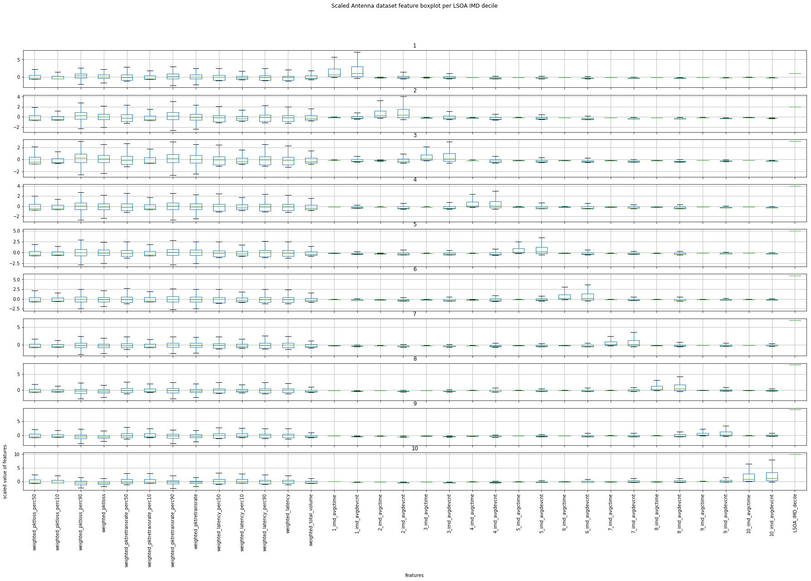
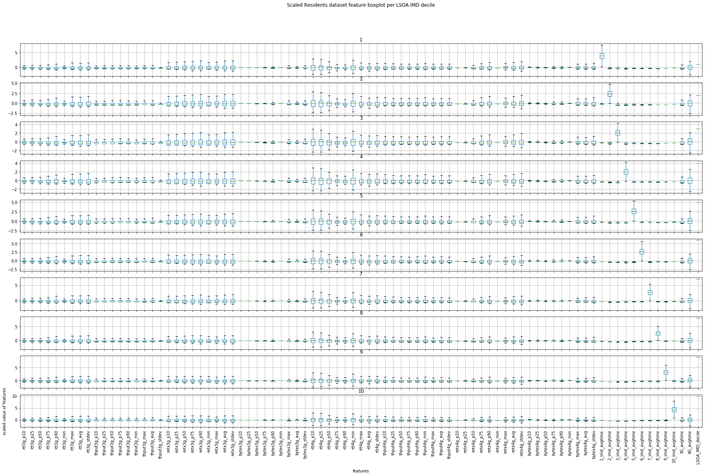
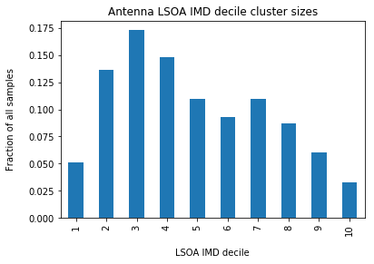
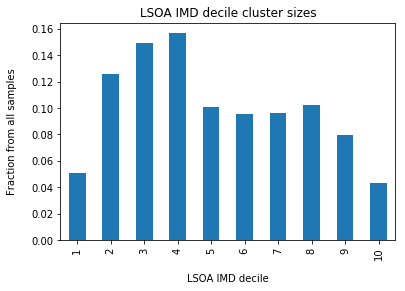
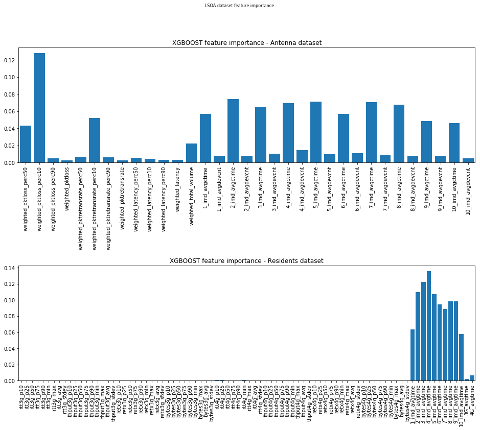

# 1. Define libraries datasets, scaling


```python
# define libraries
import pandas as pd
import numpy as np
import matplotlib.pyplot as plt
%matplotlib inline

from sklearn.preprocessing import StandardScaler
from sklearn.metrics import classification_report
from sklearn.metrics import confusion_matrix
from sklearn.model_selection import train_test_split

# https://xgboost.readthedocs.io/en/latest/
import xgboost
# https://scikit-learn.org/stable/modules/svm.html
from sklearn import svm
# https://scikit-learn.org/stable/modules/generated/sklearn.linear_model.LogisticRegressionCV.html#sklearn.linear_model.LogisticRegressionCV
from sklearn.linear_model import LogisticRegression

#https://scikit-learn.org/stable/modules/classes.html#module-sklearn.metrics
# defining scoring strategy:
# https://scikit-learn.org/stable/modules/model_evaluation.html#defining-your-scoring-strategy-from-metric-functions
# scoring needs to be changed with string, ie : LogisticRegressionCV(cv=10, random_state=0,multi_class='multinomial', scoring="f1_score").fit(samples, labels)
# https://scikit-learn.org/stable/modules/cross_validation.html
from sklearn.model_selection import cross_val_score


#sklearn.svm.LinearSVC (setting multi_class=”crammer_singer”)
#sklearn.linear_model.LogisticRegression (setting multi_class=”multinomial”)
#sklearn.linear_model.LogisticRegressionCV (setting multi_class=”multinomial”)
```


```python
# define datasets
antenna_dt_loc = '/home/sop/LondonMobility/results/Features/SectorPerf/Summary/AntennaMLDataset_FebMar_df.csv'
residents_dt_loc = '/home/sop/LondonMobility/results/Features/Performance/Summary/part-00000-99a02b3d-d2ec-41c8-a02f-f8acbc8f9c5b-c000.csv'

# drop rows with empty values
antenna_dt_pd = pd.read_csv(antenna_dt_loc, index_col=False)
antenna_dt_pd.dropna(inplace=True)

residents_dt_pd = pd.read_csv(residents_dt_loc, index_col=False)
residents_dt_pd.dropna(inplace=True)
```


```python
# drop lkey and device_id columns as they are not needed for machine learning
antenna_dt_pd_ml = antenna_dt_pd.drop(['lkey'], axis=1)
residents_dt_pd_ml = residents_dt_pd.drop(['device_id'], axis=1)

# scale the dataset to get better results, scale everything except LSOA_IMD_decile - i.e. labels
scaler = StandardScaler()
scaler.fit(antenna_dt_pd_ml[antenna_dt_pd_ml.columns[:-1]])
antenna_dt_pd_ml_scaled = pd.DataFrame(scaler.transform(antenna_dt_pd_ml[antenna_dt_pd_ml.columns[:-1]]),columns=antenna_dt_pd_ml.columns[:-1])
antenna_dt_pd_ml_scaled['LSOA_IMD_decile'] = antenna_dt_pd_ml['LSOA_IMD_decile'].values
antenna_samples = antenna_dt_pd_ml_scaled[antenna_dt_pd_ml_scaled.columns[:-1]].values
antenna_labels = antenna_dt_pd_ml_scaled['LSOA_IMD_decile'].values

scaler = StandardScaler()
scaler.fit(residents_dt_pd_ml[residents_dt_pd_ml.columns[:-1]])
residents_dt_pd_ml_scaled = pd.DataFrame(scaler.transform(residents_dt_pd_ml[residents_dt_pd_ml.columns[:-1]]),columns=residents_dt_pd_ml.columns[:-1])
residents_dt_pd_ml_scaled['LSOA_IMD_decile'] = residents_dt_pd_ml['LSOA_IMD_decile'].values
residents_samples = antenna_dt_pd_ml_scaled[antenna_dt_pd_ml_scaled.columns[:-1]].values
residents_labels = antenna_dt_pd_ml_scaled['LSOA_IMD_decile'].values
```

# 2. Graphical analysis of features in each LSOA IMD decile - boxplots of scaled features


```python
antenna_boxplot = antenna_dt_pd_ml_scaled.groupby(['LSOA_IMD_decile']).boxplot(figsize=(30, 18), subplots=True, rot=90, grid=True, layout=(10,1), sharex=True, sharey=False, showfliers=False)
title = plt.suptitle("Scaled Antenna dataset feature boxplot per LSOA IMD decile");
xlabel = plt.xlabel("features", labelpad=14)
ylabel = plt.ylabel("scaled value of features", labelpad=14)
```





```python
residents_boxplot = residents_dt_pd_ml_scaled.groupby(['LSOA_IMD_decile']).boxplot(figsize=(30, 18), subplots=True, rot=90, grid=True, layout=(10,1), sharex=True, sharey=False, showfliers=False)
title = plt.suptitle("Scaled Residents dataset feature boxplot per LSOA IMD decile");
xlabel = plt.xlabel("features", labelpad=14)
ylabel = plt.ylabel("scaled value of features", labelpad=14)
```





# 3. Sizes of clusters, i.e. number of samples per LSOA IMD decile - bar charts


```python
antenna_dt_pd_ml_scaled['LSOA_IMD_decile'].value_counts(sort=False,normalize=True).plot(kind='bar')
title = plt.title("Antenna LSOA IMD decile cluster sizes");
xlabel = plt.xlabel("LSOA IMD decile", labelpad=14)
ylabel = plt.ylabel("Fraction of all samples", labelpad=14)
```





```python
residents_dt_pd_ml_scaled['LSOA_IMD_decile'].value_counts(sort=False,normalize=True).plot(kind='bar')
title = plt.title("Residents LSOA IMD decile cluster sizes");
xlabel = plt.xlabel("LSOA IMD decile", labelpad=14)
ylabel = plt.ylabel("Fraction of all samples", labelpad=14)
```





# 4. Supervised algorithm results
## 4.1 Full feature set


```python
# prepare labels, samples, train/test datasets
antenna_dt_pd_ml_scaled = pd.read_csv('antenna_dt_pd_ml_scaled.csv', index_col=False)
residents_dt_pd_ml_scaled = pd.read_csv('residents_dt_pd_ml_scaled.csv', index_col=False)

antenna_samples = antenna_dt_pd_ml_scaled[antenna_dt_pd_ml_scaled.columns[:-1]].values
antenna_labels = antenna_dt_pd_ml_scaled['LSOA_IMD_decile'].values

residents_samples = residents_dt_pd_ml_scaled[residents_dt_pd_ml_scaled.columns[:-1]].values
residents_labels = residents_dt_pd_ml_scaled['LSOA_IMD_decile'].values

antenna_samples_train, antenna_samples_test, antenna_labels_train, antenna_labels_test = train_test_split(antenna_samples, antenna_labels, test_size=0.1)
residents_samples_train, residents_samples_test, residents_labels_train, residents_labels_test = train_test_split(residents_samples, residents_labels, test_size=0.1)
```


```python
# logistic regression
# For multiclass problems, only ‘newton-cg’, ‘sag’, ‘saga’ and ‘lbfgs’ handle multinomial loss; ‘liblinear’ is limited to one-versus-rest schemes.
# solver = ?
LR_clf_ant = LogisticRegression(multi_class='multinomial', solver='lbfgs')
# antenna
LRscores_ant = cross_val_score(LR_clf_ant, antenna_samples, antenna_labels, cv=10, scoring='f1_weighted')
LR_clf_ant.fit(antenna_samples_train,antenna_labels_train)
LRantenna_predicted = LR_clf_ant.predict(antenna_samples_test)
print('Antenna LR 10CV f1_weighted scores : ' + str(LRscores_ant))
print('Antenna LR classification report :\n' + str(classification_report(antenna_labels_test, LRantenna_predicted)))
print('Antenna LR confusion matrix :\n' + str(confusion_matrix(antenna_labels_test, LRantenna_predicted)))
# residents
LR_clf_res = LogisticRegression(multi_class='multinomial', solver='lbfgs')
LRscores_res = cross_val_score(LR_clf_res, residents_samples, residents_labels, cv=10, scoring='f1_weighted')
LR_clf_res.fit(residents_samples_train,residents_labels_train)
LRresidents_predicted = LR_clf_res.predict(residents_samples_test)
print('Residents LR 10CV f1_weighted scores : ' + str(LRscores_res))
print('Residents LR classification report :\n' + str(classification_report(residents_labels_test, LRresidents_predicted)))
print('Residents LR confusion matrix :\n' + str(confusion_matrix(residents_labels_test, LRresidents_predicted)))

# SVM
# about gamma='scale' issue : https://stackoverflow.com/questions/52582796/support-vector-regression-typeerror-must-be-real-number-not-str
SVM_clf_ant = svm.SVC(decision_function_shape='ovo')
# antenna
SVMscores_ant = cross_val_score(SVM_clf_ant, antenna_samples, antenna_labels, cv=10, scoring='f1_weighted')
SVM_clf_ant.fit(antenna_samples_train,antenna_labels_train)
SVMantenna_predicted = SVM_clf_ant.predict(antenna_samples_test)
print('Antenna SVM 10CV f1_weighted scores : ' + str(SVMscores_ant))
print('Antenna SVM classification report :\n' + str(classification_report(antenna_labels_test, SVMantenna_predicted)))
print('Antenna SVM confusion matrix :\n' + str(confusion_matrix(antenna_labels_test, SVMantenna_predicted)))
# residents
SVM_clf_res = svm.SVC(decision_function_shape='ovo')
SVMscores_res = cross_val_score(SVM_clf_res, residents_samples, residents_labels, cv=10, scoring='f1_weighted')
SVM_clf_res.fit(residents_samples_train,residents_labels_train)
SVMresidents_predicted = SVM_clf_res.predict(residents_samples_test)
print('Residents SVM 10CV f1_weighted scores : ' + str(SVMscores_res))
print('Residents SVM classification report :\n' + str(classification_report(residents_labels_test, SVMresidents_predicted)))
print('Residents SVM confusion matrix :\n' + str(confusion_matrix(residents_labels_test, SVMresidents_predicted)))

# xgboost
XGBOOST_clf_ant = xgboost.XGBClassifier()
# antenna
XGBOOSTscores_ant = cross_val_score(XGBOOST_clf_ant, antenna_samples, antenna_labels, cv=10, scoring='f1_weighted')
XGBOOST_clf_ant.fit(antenna_samples_train,antenna_labels_train)
XGBOOSTantenna_predicted = XGBOOST_clf_ant.predict(antenna_samples_test)
print('Antenna XGBOOST 10CV f1_weighted scores : ' + str(XGBOOSTscores_ant))
print('Antenna XGBOOST classification report :\n' + str(classification_report(antenna_labels_test, XGBOOSTantenna_predicted)))
print('Antenna XGBOOST confusion matrix :\n' + str(confusion_matrix(antenna_labels_test, XGBOOSTantenna_predicted)))
# residents
XGBOOST_clf_res = xgboost.XGBClassifier()
XGBOOSTscores_res = cross_val_score(XGBOOST_clf_res, residents_samples, residents_labels, cv=10, scoring='f1_weighted')
XGBOOST_clf_res.fit(residents_samples_train,residents_labels_train)
XGBOOSTresidents_predicted = XGBOOST_clf_res.predict(residents_samples_test)
print('Residents XGBOOST 10CV f1_weighted scores : ' + str(XGBOOSTscores_res))
print('Residents XGBOOST classification report :\n' + str(classification_report(residents_labels_test, XGBOOSTresidents_predicted)))
print('Residents XGBOOST confusion matrix :\n' + str(confusion_matrix(residents_labels_test, XGBOOSTresidents_predicted)))

print('XGBOOST antenna features importances :\n' + str(XGBOOST_clf_ant.feature_importances_))
print('XGBOOST residents features importances :\n' + str(XGBOOST_clf_res.feature_importances_))
```

### Output of the script above
The script was run in the background on the server as the residents dataset calculations take serveral hours.
Script:

    /home/sop/LondonMobility/ml_lsoa_analysis/full_feature_set_script.py

Results:

    /home/sop/LondonMobility/ml_lsoa_analysis/full_feature_set_results.txt

#### Logistic Regression
##### Antenna
Antenna LR 10CV f1_weighted scores : 

    [0.87560556, 0.86190394, 0.8790403, , 0.87427327, 0.88034924, 0.8714265, 0.87127021, 0.87174524, 0.87368437, 0.88281454]

Antenna LR classification report :

             precision    recall  f1-score   support
          1       0.96      0.82      0.89       165
          2       0.93      0.90      0.91       448
          3       0.74      0.91      0.82       606
          4       0.87      0.87      0.87       521
          5       0.95      0.86      0.90       384
          6       0.97      0.84      0.90       353
          7       0.87      0.88      0.87       354
          8       0.82      0.86      0.84       286
          9       0.90      0.79      0.84       204
         10       0.96      0.91      0.94       104
    avg / total   0.88      0.87      0.87      3425

Antenna LR confusion matrix :

    [[136   5  16   2   0   0   1   4   1   0]
     [  2 402  19   6   3   2   3   8   3   0]
     [  2   9 554  10   2   1   8  18   2   0]
     [  0   6  46 451   4   2   6   6   0   0]
     [  0   6  23  13 329   0   7   4   2   0]
     [  1   0  28  15   4 295   5   3   2   0]
     [  0   4  20  12   0   1 311   2   2   2]
     [  0   1  18   4   3   2   4 247   6   1]
     [  0   0  17   6   0   1  10   8 161   1]
     [  0   0   4   0   0   0   3   2   0  95]]
     
##### Residents     
Residents LR 10CV f1_weighted scores : 

    [0.96798743, 0.96579157, 0.96786503, 0.96762216, 0.96658296, 0.96084779, 0.96096328, 0.96272285, 0.96168202, 0.96286898]
    
Residents LR classification report :

             precision    recall  f1-score   support
          1       0.96      0.96      0.96      2061
          2       0.97      0.97      0.97      5130
          3       0.97      0.97      0.97      6290
          4       0.97      0.96      0.97      6501
          5       0.96      0.96      0.96      4230
          6       0.96      0.96      0.96      4074
          7       0.96      0.95      0.95      4033
          8       0.96      0.96      0.96      4155
          9       0.96      0.97      0.97      3284
         10       0.97      0.97      0.97      1751
    avg / total   0.96      0.96      0.96     41509

Residents LR confusion matrix :

    [[1977   18   20   19    7    6    3    5    5    1]
     [  20 4983   47   20   28   11   12    5    3    1]
     [  17   44 6114   45   27   17   10    9    6    1]
     [  17   31   40 6262   36   31   25   36   22    1]
     [   6   25   24   26 4068   28   23   19    9    2]
     [   5    9   15   24   28 3931   15   22   17    8]
     [   6   20   29   38   30   20 3813   36   31   10]
     [   2    7   20   27   11   13   36 4002   20   17]
     [   2    1    5   10    9   14   14   23 3189   17]
     [   0    1    0    5    6    8    8   15   15 1693]]

#### SVM
##### Antenna
Antenna SVM 10CV f1_weighted scores : 
    
    [0.76111178, 0.75934491, 0.77520498, 0.76847917, 0.76965818, 0.76664688, 0.76751445, 0.78620269, 0.76955391, 0.77925448]
    
Antenna SVM classification report :

             precision    recall  f1-score   support
          1       0.93      0.73      0.82       165
          2       0.88      0.81      0.85       448
          3       0.63      0.88      0.74       606
          4       0.69      0.78      0.73       521
          5       0.86      0.71      0.78       384
          6       0.90      0.66      0.76       353
          7       0.75      0.78      0.77       354
          8       0.81      0.77      0.79       286
          9       0.89      0.65      0.75       204
         10       0.92      0.79      0.85       104
    avg / total   0.79      0.77      0.77      3425

Antenna SVM confusion matrix :

    [[120   5  30   4   1   0   1   1   3   0]
     [  0 364  38  22   5   4   8   5   2   0]
     [  5   9 535  25   6   5  11   9   1   0]
     [  3  15  65 404   8   4  13   6   3   0]
     [  0   6  44  37 272   3  18   3   0   1]
     [  1   1  48  37  11 233  12   8   0   2]
     [  0   6  28  23   3   4 277   6   5   2]
     [  0   4  30  17   4   1   8 220   1   1]
     [  0   3  24  11   4   4  15   9 133   1]
     [  0   0   5   7   1   0   4   3   2  82]]

##### Residents       
Residents SVM 10CV f1_weighted scores : 

    [0.96210845, 0.95974829, 0.96153084, 0.96160187, 0.96147266, 0.9553046, 0.95536256, 0.95855823, 0.9560232, 0.95766261]
    
Residents SVM classification report :

             precision    recall  f1-score   support
          1       0.96      0.96      0.96      2061
          2       0.96      0.97      0.96      5130
          3       0.96      0.97      0.96      6290
          4       0.95      0.96      0.96      6501
          5       0.96      0.96      0.96      4230
          6       0.96      0.96      0.96      4074
          7       0.96      0.94      0.95      4033
          8       0.96      0.96      0.96      4155
          9       0.96      0.96      0.96      3284
         10       0.96      0.96      0.96      1751
    avg / total   0.96      0.96      0.96     41509

Residents SVM confusion matrix :

    [[1975   16   21   23    7    3    4    5    5    2]
     [  23 4954   52   30   29   12   15    9    4    2]
     [  20   53 6080   61   29   16   11   11    8    1]
     [  18   32   47 6245   36   33   28   39   19    4]
     [   8   29   32   40 4043   26   22   19    8    3]
     [   6   18   28   33   24 3902   17   21   16    9]
     [   7   22   37   53   34   25 3773   38   29   15]
     [   2   14   26   35   11   11   26 3993   21   16]
     [   3    6    9   23    8   13   15   21 3168   18]
     [   0    1    5   14    5    4    6   13   15 1688]]

#### XGBOOST
##### Antenna
Antenna XGBOOST 10CV f1_weighted scores : 

    [0.9123163, , 0.8990322, , 0.90395565, 0.90791748, 0.91131416, 0.91159137, 0.91701889, 0.90934044, 0.90627642, 0.92199817]
    
Antenna XGBOOST classification report :

             precision    recall  f1-score   support
          1       0.97      0.90      0.93       165
          2       0.89      0.95      0.92       448
          3       0.87      0.91      0.89       606
          4       0.88      0.89      0.89       521
          5       0.95      0.89      0.92       384
          6       0.92      0.90      0.91       353
          7       0.92      0.91      0.91       354
          8       0.91      0.92      0.92       286
          9       0.94      0.87      0.90       204
         10       0.97      0.94      0.96       104
    avg / total   0.91      0.91      0.91      3425

Antenna XGBOOST confusion matrix :

    [[148   3  10   3   0   1   0   0   0   0]
     [  3 426   9   6   1   2   1   0   0   0]
     [  0  15 554  15   4   3   7   5   3   0]
     [  1   8  26 463   6   6   5   6   0   0]
     [  0   5   7  12 341   8   4   5   2   0]
     [  0   2  12  11   2 318   2   2   2   2]
     [  0   3  12   4   2   4 323   2   3   1]
     [  0   9   4   3   1   1   4 263   1   0]
     [  0   5   1   7   1   3   6   3 178   0]
     [  0   0   2   0   0   0   1   2   1  98]]
     
XGBOOST antenna features importances :

    [0.04330156, 0.12807314, 0.00510513, 0.00270002, 0.00649124, 0.05210192, 0.00613526, 0.00243871, 0.00565583, 0.00450801, 0.00306396, 0.00277598, 0.02206511, 0.05703443, 0.00796382, 0.07440744, 0.00752969, 0.06535211, 0.00998182, 0.06929886, 0.01417172, 0.07100398, 0.00960822, 0.05689183, 0.01052365, 0.07067223, 0.00828135, 0.06771853, 0.0079359, , 0.04848456, 0.00806365, 0.04588205, 0.00477827]
    
##### Residents       
Residents XGBOOST 10CV f1_weighted scores : 

    [0.96872684, 0.96667148, 0.96892066, 0.96934734, 0.96814007, 0.96250368, 0.96228457, 0.96391869, 0.96409007, 0.96442005]
    
Residents XGBOOST classification report :

             precision    recall  f1-score   support
          1       0.96      0.97      0.96      2061
          2       0.97      0.98      0.97      5130
          3       0.97      0.97      0.97      6290
          4       0.97      0.97      0.97      6501
          5       0.96      0.96      0.96      4230
          6       0.96      0.97      0.97      4074
          7       0.97      0.94      0.95      4033
          8       0.96      0.96      0.96      4155
          9       0.96      0.98      0.97      3284
         10       0.96      0.97      0.97      1751
    avg / total   0.97      0.97      0.97     41509

Residents XGBOOST confusion matrix :

    [[1993   15   20   13    4    4    2    4    4    2]
     [  20 5002   43   13   22    9    9    7    3    2]
     [  20   44 6117   42   21   18    8   12    7    1]
     [  17   27   42 6284   28   33   21   30   17    2]
     [   5   26   29   33 4054   31   21   21    8    2]
     [   8   15   16   26   18 3936   14   21   14    6]
     [   7   22   30   44   32   21 3786   42   34   15]
     [   3    7   21   27   11   14   27 4008   22   15]
     [   3    1    5    7    8   13    6   18 3205   18]
     [   0    1    0    7    4    4    5   12   16 1702]]     

XGBOOST residents features importances :

    [1.37012859e-04, 9.29936650e-05, 1.47561645e-04, 1.85320372e-04, 1.88561506e-04, 1.66560902e-04, 6.71887756e-05, 1.09087414e-04, 2.37818749e-04, 1.33185793e-04, 7.94579682e-05, 1.59574323e-04, 4.52897475e-05, 3.98012417e-05, 2.11115723e-04, 8.65375623e-05, 3.22740350e-04, 3.37643251e-05, 1.25390710e-04, 2.54529994e-04, 7.22995901e-05, 1.70249172e-04, 2.10797079e-04, 0.00000000e+00, 3.13379540e-04, 2.08585363e-04, 2.17352339e-04, 8.04648444e-05, 6.23141677e-05, 1.92052481e-04, 9.85284423e-05, 1.57218674e-04, 1.30868400e-04, 7.88160105e-05, 1.36218834e-04, 7.13628688e-05, 6.75217481e-04, 8.20389483e-04, 4.59591713e-04, 2.18533547e-04, 3.73666378e-04, 8.92930781e-04, 2.80000619e-04, 4.67531616e-04, 2.66228977e-04, 1.34617920e-04, 6.64259351e-05, 1.89145998e-04, 1.48666339e-04, 1.67373946e-04, 1.80752570e-04, 1.27112289e-04, 1.97716334e-04, 7.56545342e-05, 1.91485189e-04, 2.98112980e-04, 2.83633068e-04, 2.33283339e-04, 2.10620550e-04, 1.47630097e-04, 5.54742801e-05, 6.85028717e-05, 4.82372561e-04, 1.54069887e-04, 9.55838041e-05, 6.53529132e-05, 1.18793585e-04, 2.64627015e-04, 2.46985117e-04, 5.58570937e-05, 1.38011717e-04, 8.01551942e-05, 6.38561696e-02, 1.09744258e-01, 1.22673534e-01, 1.35559663e-01, 1.07100837e-01, 9.45502222e-02, 8.89494792e-02, 9.85353515e-02, 9.83233154e-02, 5.76156974e-02, 2.35540373e-03, 6.77996548e-03]


```python
fig, ax = plt.subplots(2, 1, figsize=(16, 12))
fig.suptitle('LSOA dataset feature importance', fontsize=8)

XGBOOST_clf_ant_feature_importances = [0.04330156,0.12807314,0.00510513,0.00270002,0.00649124,0.05210192\
                                       ,0.00613526,0.00243871,0.00565583,0.00450801,0.00306396,0.00277598\
                                       ,0.02206511,0.05703443,0.00796382,0.07440744,0.00752969,0.06535211\
                                       ,0.00998182,0.06929886,0.01417172,0.07100398,0.00960822,0.05689183\
                                       ,0.01052365,0.07067223,0.00828135,0.06771853,0.0079359,0.04848456\
                                       ,0.00806365,0.04588205,0.00477827]
XGBOOST_clf_res_feature_importances = [1.37012859e-04,9.29936650e-05,1.47561645e-04,1.85320372e-04\
                                       ,1.88561506e-04,1.66560902e-04,6.71887756e-05,1.09087414e-04\
                                       ,2.37818749e-04,1.33185793e-04,7.94579682e-05,1.59574323e-04\
                                       ,4.52897475e-05,3.98012417e-05,2.11115723e-04,8.65375623e-05\
                                       ,3.22740350e-04,3.37643251e-05,1.25390710e-04,2.54529994e-04\
                                       ,7.22995901e-05,1.70249172e-04,2.10797079e-04,0.00000000e+00\
                                       ,3.13379540e-04,2.08585363e-04,2.17352339e-04,8.04648444e-05\
                                       ,6.23141677e-05,1.92052481e-04,9.85284423e-05,1.57218674e-04\
                                       ,1.30868400e-04,7.88160105e-05,1.36218834e-04,7.13628688e-05\
                                       ,6.75217481e-04,8.20389483e-04,4.59591713e-04,2.18533547e-04\
                                       ,3.73666378e-04,8.92930781e-04,2.80000619e-04,4.67531616e-04\
                                       ,2.66228977e-04,1.34617920e-04,6.64259351e-05,1.89145998e-04\
                                       ,1.48666339e-04,1.67373946e-04,1.80752570e-04,1.27112289e-04\
                                       ,1.97716334e-04,7.56545342e-05,1.91485189e-04,2.98112980e-04\
                                       ,2.83633068e-04,2.33283339e-04,2.10620550e-04,1.47630097e-04\
                                       ,5.54742801e-05,6.85028717e-05,4.82372561e-04,1.54069887e-04\
                                       ,9.55838041e-05,6.53529132e-05,1.18793585e-04,2.64627015e-04\
                                       ,2.46985117e-04,5.58570937e-05,1.38011717e-04,8.01551942e-05\
                                       ,6.38561696e-02,1.09744258e-01,1.22673534e-01,1.35559663e-01\
                                       ,1.07100837e-01,9.45502222e-02,8.89494792e-02,9.85353515e-02\
                                       ,9.83233154e-02,5.76156974e-02,2.35540373e-03,6.77996548e-03]


ax[0].set_title("XGBOOST feature importance - Antenna dataset")
ax[0].bar(range(len(XGBOOST_clf_ant_feature_importances)), XGBOOST_clf_ant_feature_importances)
ax[0].set_xticks(np.arange(0, len(XGBOOST_clf_ant_feature_importances), step=1))
ax[0].set_xticklabels(antenna_dt_pd_ml_scaled.columns[:-1].values,rotation='vertical')
ax[0].set_xlim([-0.5,len(XGBOOST_clf_ant_feature_importances)-0.5])

ax[1].set_title("XGBOOST feature importance - Residents dataset")
ax[1].bar(range(len(XGBOOST_clf_res_feature_importances)), XGBOOST_clf_res_feature_importances)
ax[1].set_xticks(np.arange(0, len(XGBOOST_clf_res_feature_importances), step=1))
ax[1].set_xticklabels(residents_dt_pd_ml_scaled.columns[:-1].values,rotation='vertical')
ax[1].set_xlim([-0.5,len(XGBOOST_clf_res_feature_importances)-0.5])
plt.subplots_adjust(hspace=0.9)
```





## 4.2 Feature subsets
Computations take couple of hours - especially for residents dataset. They were run in background on the server.

Scripts:

    /home/sop/LondonMobility/ml_lsoa_analysis/antenna_subsets_script.py
    /home/sop/LondonMobility/ml_lsoa_analysis/residents_subsets_script.py

Results:

    /home/sop/LondonMobility/ml_lsoa_analysis/antenna_subsets_results.txt
    /home/sop/LondonMobility/ml_lsoa_analysis/residents_subsets_results-temp1.txt


```python
antenna_feature_subset_mobility = ['1_imd_avgctime', '1_imd_avgdevcnt', '2_imd_avgctime', '2_imd_avgdevcnt',\
                                  '3_imd_avgctime', '3_imd_avgdevcnt', '4_imd_avgctime', '4_imd_avgdevcnt',\
                                  '5_imd_avgctime', '5_imd_avgdevcnt', '6_imd_avgctime', '6_imd_avgdevcnt',\
                                  '7_imd_avgctime', '7_imd_avgdevcnt', '8_imd_avgctime', '8_imd_avgdevcnt',\
                                  '9_imd_avgctime', '9_imd_avgdevcnt', '10_imd_avgctime', '10_imd_avgdevcnt']
antenna_feature_subset_sector = ['weighted_pktloss_perc50', 'weighted_pktloss_perc10', 'weighted_pktloss_perc90',\
                                 'weighted_pktloss', 'weighted_pktretransrate_perc50', 'weighted_pktretransrate_perc10',\
                                 'weighted_pktretransrate_perc90', 'weighted_pktretransrate', 'weighted_latency_perc50',\
                                 'weighted_latency_perc10', 'weighted_latency_perc90', 'weighted_latency', 'weighted_total_volume']
residents_feature_subset_mobility34g = ['1_imd_avgtime', '2_imd_avgtime', '3_imd_avgtime', '4_imd_avgtime',\
                                      '5_imd_avgtime', '6_imd_avgtime', '7_imd_avgtime', '8_imd_avgtime',\
                                      '9_imd_avgtime', '10_imd_avgtime','3G_avgtime', '4G_avgtime']
residents_feature_subset_mobility = ['1_imd_avgtime', '2_imd_avgtime', '3_imd_avgtime', '4_imd_avgtime', '5_imd_avgtime',
                                   '6_imd_avgtime', '7_imd_avgtime', '8_imd_avgtime', '9_imd_avgtime', '10_imd_avgtime']
residents_feature_subset_perf34g = ['rtt3g_p10', 'rtt3g_p25', 'rtt3g_p50', 'rtt3g_p75',\
                                  'rtt3g_p90', 'rtt3g_min', 'rtt3g_max', 'rtt3g_avg',\
                                  'rtt3g_stdev', 'thput3g_p10', 'thput3g_p25', 'thput3g_p50',\
                                  'thput3g_p75', 'thput3g_p90', 'thput3g_min', 'thput3g_max',\
                                  'thput3g_avg', 'thput3g_stdev', 'retx3g_p10', 'retx3g_p25',\
                                  'retx3g_p50', 'retx3g_p75', 'retx3g_p90', 'retx3g_min',\
                                  'retx3g_max', 'retx3g_avg', 'retx3g_stdev', 'bytes3g_p10',\
                                  'bytes3g_p25', 'bytes3g_p50', 'bytes3g_p75', 'bytes3g_p90',\
                                  'bytes3g_min', 'bytes3g_max', 'bytes3g_avg', 'bytes3g_stdev',\
                                  'rtt4g_p10', 'rtt4g_p25', 'rtt4g_p50', 'rtt4g_p75',\
                                  'rtt4g_p90', 'rtt4g_min', 'rtt4g_max', 'rtt4g_avg',\
                                  'rtt4g_stdev', 'thput4g_p10', 'thput4g_p25', 'thput4g_p50',\
                                  'thput4g_p75', 'thput4g_p90', 'thput4g_min', 'thput4g_max',\
                                  'thput4g_avg', 'thput4g_stdev', 'retx4g_p10', 'retx4g_p25',\
                                  'retx4g_p50', 'retx4g_p75', 'retx4g_p90', 'retx4g_min',\
                                  'retx4g_max', 'retx4g_avg', 'retx4g_stdev', 'bytes4g_p10',\
                                  'bytes4g_p25', 'bytes4g_p50', 'bytes4g_p75', 'bytes4g_p90',\
                                  'bytes4g_min', 'bytes4g_max', 'bytes4g_avg', 'bytes4g_stdev']
residents_feature_subset_perf3g = ['rtt3g_p10', 'rtt3g_p25', 'rtt3g_p50', 'rtt3g_p75',\
                                  'rtt3g_p90', 'rtt3g_min', 'rtt3g_max', 'rtt3g_avg',\
                                  'rtt3g_stdev', 'thput3g_p10', 'thput3g_p25', 'thput3g_p50',\
                                  'thput3g_p75', 'thput3g_p90', 'thput3g_min', 'thput3g_max',\
                                  'thput3g_avg', 'thput3g_stdev', 'retx3g_p10', 'retx3g_p25',\
                                  'retx3g_p50', 'retx3g_p75', 'retx3g_p90', 'retx3g_min',\
                                  'retx3g_max', 'retx3g_avg', 'retx3g_stdev', 'bytes3g_p10',\
                                  'bytes3g_p25', 'bytes3g_p50', 'bytes3g_p75', 'bytes3g_p90',\
                                  'bytes3g_min', 'bytes3g_max', 'bytes3g_avg', 'bytes3g_stdev']
residents_feature_subset_perf4g = ['rtt4g_p10', 'rtt4g_p25', 'rtt4g_p50', 'rtt4g_p75',\
                                  'rtt4g_p90', 'rtt4g_min', 'rtt4g_max', 'rtt4g_avg',\
                                  'rtt4g_stdev', 'thput4g_p10', 'thput4g_p25', 'thput4g_p50',\
                                  'thput4g_p75', 'thput4g_p90', 'thput4g_min', 'thput4g_max',\
                                  'thput4g_avg', 'thput4g_stdev', 'retx4g_p10', 'retx4g_p25',\
                                  'retx4g_p50', 'retx4g_p75', 'retx4g_p90', 'retx4g_min',\
                                  'retx4g_max', 'retx4g_avg', 'retx4g_stdev', 'bytes4g_p10',\
                                  'bytes4g_p25', 'bytes4g_p50', 'bytes4g_p75', 'bytes4g_p90',\
                                  'bytes4g_min', 'bytes4g_max', 'bytes4g_avg', 'bytes4g_stdev']

```

### 4.2.1 Antenna feature subsets
#### 4.2.1.1 antenna_feature_subset_mobility
##### Logistic Regression
Antenna LR 10CV f1_weighted scores : [0.87464233 0.87099324 0.87559499 0.87789664 0.87793183 0.87353143
 0.88834426 0.87871298 0.87877473 0.89009563]
Antenna LR classification report :

             precision    recall  f1-score   support
          1       0.99      0.89      0.93       167
          2       0.95      0.89      0.92       464
          3       0.72      0.95      0.82       601
          4       0.88      0.89      0.89       511
          5       0.95      0.87      0.91       374
          6       0.95      0.86      0.90       277
          7       0.92      0.86      0.89       374
          8       0.92      0.87      0.89       313
          9       0.93      0.77      0.84       222
         10       0.95      0.84      0.90       122
    avg / total   0.89      0.88      0.88      3425

Antenna LR confusion matrix :

    [[148   5  13   1   0   0   0   0   0   0]
    [  0 415  37   5   2   2   1   2   0   0]
    [  1   6 572  12   4   1   4   1   0   0]
    [  1   2  44 457   1   3   1   1   1   0]
    [  0   2  25  14 324   0   4   2   2   1]
    [  0   1  17  11   2 239   4   1   2   0]
    [  0   1  23  15   1   4 320   4   5   1]
    [  0   1  29   3   3   1   2 271   2   1]
    [  0   4  24   3   1   2   8   7 171   2]
    [  0   0   7   0   2   0   3   6   1 103]]

#####  SVM
Antenna SVM 10CV f1_weighted scores : 

    [0.79815171 0.79184431 0.79390913 0.79463888 0.79954016 0.79661125 0.80418698 0.8033657  0.8034623  0.8141436 ]
    
Antenna SVM classification report :

             precision    recall  f1-score   support
          1       0.91      0.78      0.84       167
          2       0.93      0.82      0.87       464
          3       0.59      0.91      0.71       601
          4       0.83      0.81      0.82       511
          5       0.92      0.77      0.84       374
          6       0.89      0.74      0.81       277
          7       0.87      0.78      0.82       374
          8       0.89      0.80      0.85       313
          9       0.82      0.69      0.75       222
         10       0.91      0.74      0.81       122
    avg / total   0.83      0.80      0.81      3425

Antenna SVM confusion matrix :

    [[131   4  27   3   0   0   1   0   1   0]
     [  5 379  57   9   5   3   2   3   1   0]
     [  3   9 548  17   5   3   7   5   4   0]
     [  3   9  64 414   4   9   4   2   2   0]
     [  1   0  51  18 288   2   6   2   5   1]
     [  0   1  45  12   3 205   6   2   3   0]
     [  1   1  48  11   0   5 292   5   7   4]
     [  0   1  39   6   3   1   3 251   7   2]
     [  0   2  37   6   3   3   7   9 153   2]
     [  0   0  16   2   2   0   6   2   4  90]]

##### XGBOOST
Antenna XGBOOST 10CV f1_weighted scores : 

    [0.91054506 0.89449145 0.90626782 0.90757051 0.91049699 0.90820279 0.91614706 0.91052841 0.90345458 0.9162234 ]
    
Antenna XGBOOST classification report :

             precision    recall  f1-score   support
          1       0.95      0.92      0.93       167
          2       0.91      0.94      0.92       464
          3       0.88      0.92      0.90       601
          4       0.89      0.91      0.90       511
          5       0.94      0.90      0.92       374
          6       0.91      0.89      0.90       277
          7       0.92      0.89      0.91       374
          8       0.88      0.92      0.90       313
          9       0.93      0.86      0.89       222
         10       0.97      0.91      0.94       122
    avg / total   0.91      0.91      0.91      3425

Antenna XGBOOST confusion matrix :

    [[153   2   9   1   1   0   1   0   0   0]
     [  1 437  14   7   3   2   0   0   0   0]
     [  2  13 552  11   5   4   7   7   0   0]
     [  4   6  22 464   3   4   3   4   1   0]
     [  0   3   9   9 336   4   7   4   2   0]
     [  0   6   7   6   3 246   4   3   1   1]
     [  0   1   8  13   2   5 334   7   4   0]
     [  0  10   1   5   3   2   1 289   1   1]
     [  1   3   2   3   1   2   7  10 191   2]
     [  0   0   0   0   1   2   0   3   5 111]]
     
Antenna XGBOOST features importances :

    [0.07272629 0.00699519 0.09784676 0.00959284 0.08834816 0.01319227 0.09198646 0.04188019 0.09016985 0.02762164 0.07793795 0.03649079 0.08911076 0.01733383 0.08712126 0.01468554 0.0578226 0.00952459 0.06327463 0.00633844]

weight : 

    387, 118, 614, 171, 704, 180, 704, 142, 551, 172, 533, 121, 519, 189, 564, 132, 545, 190, 366, 81
gain : 

    91.86994638950128, 8.836531642349152, 123.60286160857497, 12.117953089231582, 111.60394292200426, 16.664862123172224, 116.1999594263165, 52.904269995838014, 113.90515978709821, 34.892450403104654, 98.4534736203565, 46.096218819132226, 112.56729376231988, 21.896594868613757, 110.05409949804782, 18.55119477126514, 73.04318563954679, 12.031734136789474, 79.93033777566934, 8.006895520876546
    
cover : 

    974.207316871577, 295.7154528237287, 1280.193718378013, 771.3122104315789, 1467.1962246072455, 1183.2210813638887, 1460.1853623174704, 786.4332684880278, 1321.6957551313983, 575.7224700418606, 1287.6738545575042, 544.9556228239669, 1290.6680034673816, 888.6934786338626, 1204.0691104005316, 675.0086063015152, 898.8927612400001, 331.40679898426316, 806.447386885054, 295.94299940740734
    
total_gain : 

    35553.669252736996, 1042.7107337972, 75892.15702766503, 2072.1699782586006, 78569.175817091, 2999.6751821710004, 81804.77143612682, 7512.406339408998, 62761.743042691116, 6001.501469334001, 52475.701439650016, 5577.642477115, 58422.425462644016, 4138.456430168, 62070.51211689897, 2448.7577098069987, 39808.536173553, 2286.02948599, 29254.50362589498, 648.5585371910003

total_cover : 

    377018.2316293003, 34894.42343319998, 786038.9430841, 131894.3879838, 1032906.1421235008, 212979.7946455, 1027970.4950714993, 111673.52412529995, 728254.3610774005, 99024.26484720001, 686330.1644791497, 65939.6303617, 669856.693799571, 167963.06746180003, 679094.9782658998, 89101.13603180001, 489896.5548758001, 62967.29180701, 295159.7435999298, 23971.382951999996

#### 4.2.1.2 antenna_feature_subset_sector
##### Logistic regression
Antenna LR 10CV f1_weighted scores : 

    [0.13805416, 0.13828046, 0.14057277, 0.14336456, 0.13850934, 0.13203759, 0.13453722, 0.14723532, 0.15361352, 0.12636711]

Antenna LR classification report :

             precision    recall  f1-score   support
          1       0.00      0.00      0.00       165
          2       0.25      0.10      0.14       451
          3       0.23      0.68      0.34       629
          4       0.15      0.15      0.15       470
          5       0.21      0.02      0.03       381
          6       0.50      0.00      0.01       326
          7       0.20      0.22      0.21       394
          8       0.19      0.24      0.21       285
          9       0.13      0.02      0.03       207
         10       0.00      0.00      0.00       117
    avg / total   0.21      0.21      0.15      3425

Antenna LR confusion matrix :

    [[  0  22 112  13   1   0  15   0   2   0]
     [  0  46 312  36   3   0  24  27   2   1]
     [  0  42 427  71   2   0  36  47   2   2]
     [  0  27 287  72   2   0  50  28   3   1]
     [  0  15 216  64   6   0  33  42   4   1]
     [  0  14 166  50   5   1  62  27   1   0]
     [  0   9 168  63   5   0  88  54   6   1]
     [  0   9  97  50   2   0  53  69   4   1]
     [  0   1  70  40   1   1  51  39   4   0]
     [  0   0  31  16   2   0  35  30   3   0]]

##### SVM
Antenna SVM 10CV f1_weighted scores : 

    [0.16030526, 0.16855758, 0.17697297, 0.16779781, 0.18013519, 0.16310528, 0.14957345, 0.17385757, 0.16486646, 0.16194878]
    
Antenna SVM classification report :

             precision    recall  f1-score   support
          1       0.00      0.00      0.00       169
          2       0.33      0.14      0.20       454
          3       0.23      0.70      0.35       584
          4       0.16      0.23      0.19       521
          5       0.17      0.02      0.04       374
          6       0.00      0.00      0.00       324
          7       0.22      0.23      0.23       392
          8       0.17      0.18      0.17       284
          9       1.00      0.03      0.06       207
         10       0.00      0.00      0.00       116
    avg / total   0.23      0.22      0.16      3425

Antenna SVM confusion matrix :

    [[  0  22 116  18   2   0   6   5   0   0]
     [  0  64 278  75   1   1  22  13   0   0]
     [  0  33 406  91   4   0  24  26   0   0]
     [  0  21 287 119   6   1  56  31   0   0]
     [  0  17 192  76   8   3  46  32   0   0]
     [  0   9 156  84   8   0  41  26   0   0]
     [  0  15 127 110   7   0  91  42   0   0]
     [  0   7  95  75   4   0  52  51   0   0]
     [  0   6  53  50   5   0  43  44   6   0]
     [  0   0  29  29   2   0  24  32   0   0]]

##### XGBOOST
Antenna XGBOOST 10CV f1_weighted scores : 

    [0.16240793, 0.17564478, 0.17247159, 0.18381259, 0.17655051, 0.17447292, 0.15680946, 0.17440318, 0.1713481, 0.16904486]

Antenna XGBOOST classification report :

             precision    recall  f1-score   support
          1       0.50      0.01      0.02       169
          2       0.27      0.32      0.29       454
          3       0.23      0.57      0.33       584
          4       0.19      0.21      0.20       521
          5       0.26      0.04      0.07       374
          6       0.43      0.02      0.04       324
          7       0.24      0.25      0.24       392
          8       0.22      0.28      0.25       284
          9       0.27      0.04      0.07       207
         10       0.00      0.00      0.00       116
    avg / total   0.26      0.23      0.19      3425

Antenna XGBOOST confusion matrix :

    [[  2  44  96  12   2   0   5   8   0   0]
     [  0 146 201  63   4   2  17  20   1   0]
     [  1 104 333  63   8   2  36  35   2   0]
     [  0  76 245 107   3   0  48  39   3   0]
     [  1  53 151  73  16   2  40  36   2   0]
     [  0  43 132  54   8   6  52  25   2   2]
     [  0  40 118  74  11   0  97  47   5   0]
     [  0  21  78  55   3   1  43  79   3   1]
     [  0  12  60  36   3   1  48  39   8   0]
     [  0   7  22  27   4   0  26  26   4   0]]

Antenna XGBOOST features importances :

    [0.07677774, 0.06178833, 0.11400992, 0.11198197, 0.07180817, 0.05961196, 0.06530163, 0.07936504, 0.06343717, 0.06280398, 0.05802283, 0.10859713, 0.06649413]
    
weight : 

    339, 252, 1025, 730, 381, 195, 602, 718, 416, 358, 486, 652, 572

gain : 

    8.745658918418588, 7.038233427694442, 12.986731433056569, 12.75573095705205, 8.179581056868761, 6.790326190415387, 7.438429999158373, 9.040374658295272, 7.226051253016826, 7.153924655999996, 6.609309482821399, 12.370166710441719, 7.574265651096149
    
cover : 

    2548.1861665903834, 1374.9899412124994, 2898.731156220765, 2591.2924033500226, 2371.0986452607876, 1818.743179446358, 2499.5100308189726, 2716.9650045011326, 2268.4748479081254, 1984.104435835949, 1629.2515665594647, 2516.5634227797545, 2357.37202375093

total_gain : 

    2964.7783733439014, 1773.6348237789994, 13311.399718882984, 9311.683598647996, 3116.4203826669977, 1324.1136071310004, 4477.934859493341, 6490.989004656006, 3006.037321255, 2561.1050268479985, 3212.1244086512, 8065.348695208001, 4332.479952426997
    
total_cover : 
    
    863835.1104741399, 346497.46518554987, 2971199.435126284, 1891643.4544455165, 903388.5838443601, 354654.9199920398, 1504705.0385530214, 1950780.8732318133, 943685.5367297803, 710309.3880292698, 791816.2613478998, 1640799.3516524, 1348416.797585532

### 4.2.2 Residents feature subsets
#### 4.2.2.1 residents_feature_subset_mobility34g

##### Logistic Regression
Residents LR 10CV f1_weighted scores : 

    [0.96801052, 0.96564504, 0.96829921, 0.96764524, 0.96648558, 0.96125696, 0.96072303, 0.96327722, 0.96209204, 0.96322882]

Residents LR classification report :

             precision    recall  f1-score   support
          1       0.97      0.97      0.97      2080
          2       0.97      0.97      0.97      5300
          3       0.97      0.97      0.97      6318
          4       0.96      0.96      0.96      6477
          5       0.96      0.96      0.96      4113
          6       0.96      0.96      0.96      3862
          7       0.96      0.95      0.95      4019
          8       0.97      0.96      0.96      4257
          9       0.96      0.96      0.96      3305
         10       0.96      0.97      0.97      1778
    avg / total   0.96      0.96      0.96     41509

Residents LR confusion matrix :

    [[2016   14   14   16    7    5    3    3    2    0]
     [  15 5151   52   29   19   13   14    5    2    0]
     [  18   59 6112   55   20   21   18    8    6    1]
     [   9   38   43 6246   36   27   26   33   14    5]
     [   2   21   19   30 3968   21   21   10   11   10]
     [   6   14   13   17   23 3713   21   22   27    6]
     [   9   13   18   38   29   27 3823   24   28   10]
     [   4   10   21   36   16   15   37 4079   22   17]
     [   4    3    9   17    5   12   27   16 3187   25]
     [   1    0    0    3    3   11    8   13   10 1729]]

##### SVM
Residents SVM 10CV f1_weighted scores : 

    [0.9688009, 0.96780567, 0.9702722, 0.96942295, 0.96840639, 0.96250427, 0.96313085, 0.96474363, 0.96373179, 0.96447634]

Residents SVM classification report :

             precision    recall  f1-score   support
          1       0.96      0.98      0.97      2080
          2       0.97      0.97      0.97      5300
          3       0.97      0.97      0.97      6318
          4       0.97      0.97      0.97      6477
          5       0.97      0.96      0.97      4113
          6       0.96      0.96      0.96      3862
          7       0.96      0.95      0.96      4019
          8       0.97      0.96      0.97      4257
          9       0.97      0.97      0.97      3305
         10       0.96      0.98      0.97      1778
    avg / total   0.97      0.97      0.97     41509

Residents SVM confusion matrix :

    [[2030   13   13   10    4    3    2    3    2    0]
     [  17 5159   47   26   13   15   12    6    4    1]
     [  24   65 6114   45   16   19   16   11    6    2]
     [   8   38   43 6272   28   32   19   23    7    7]
     [   2   22   21   33 3952   24   25   13   10   11]
     [   7   14   15   19   21 3715   17   21   28    5]
     [  10   15   16   36   21   24 3826   32   27   12]
     [   4    9   18   24   14   19   23 4103   22   21]
     [   3    2    8   17    5   11   24   15 3199   21]
     [   1    0    0    2    3    7    6    8    9 1742]]
     
##### XGBOOST

Residents XGBOOST 10CV f1_weighted scores : 

    [0.96887135, 0.96708232, 0.96904094, 0.9692261, 0.9683074, 0.96259957, 0.96221344, 0.96399242, 0.96425773, 0.96480753]

Residents XGBOOST classification report :

             precision    recall  f1-score   support
          1       0.97      0.97      0.97      2080
          2       0.97      0.97      0.97      5300
          3       0.97      0.97      0.97      6318
          4       0.96      0.97      0.97      6477
          5       0.97      0.96      0.96      4113
          6       0.96      0.96      0.96      3862
          7       0.97      0.95      0.96      4019
          8       0.97      0.96      0.97      4257
          9       0.96      0.97      0.96      3305
         10       0.96      0.98      0.97      1778
    avg / total   0.97      0.97      0.97     41509

Residents XGBOOST confusion matrix :

    [[2025   14   12   14    5    2    2    3    3    0]
     [  16 5162   49   27   15   12    9    5    4    1]
     [  22   62 6115   48   16   21   14   12    6    2]
     [   9   38   40 6280   27   31   16   24    7    5]
     [   2   25   22   36 3951   28   15   13   11   10]
     [   8   18   15   20   21 3714   18   18   27    3]
     [   9   15   17   41   25   25 3818   25   32   12]
     [   2    8   20   33   14   16   25 4094   27   18]
     [   3    2    8   18    7   12   23   14 3193   25]
     [   1    0    0    2    3    8    4   12   10 1738]]
 
Residents XGBOOST features importances :

    [0.06933898, 0.10777035, 0.13145292, 0.13331982, 0.10040218, 0.09977605, 0.08847483, 0.10575587, 0.09498658, 0.05998726, 0.00254729, 0.00618791]

weight : 
    
    409, 503, 452, 455, 452, 443, 488, 441, 419, 412, 820, 1164
gain : 

    1267.8958930602157, 1970.631436895257, 2403.678294964348, 2437.815374650628, 1835.901061774175, 1824.4518744018671, 1617.8038765187382, 1933.795537281561, 1736.874106777725, 1096.8950953926442, 46.578359463828164, 113.14883935461259
cover : 

    9514.811376169017, 10108.216077766318, 11840.887070607938, 12018.062846480923, 9913.994128833201, 10083.108636410992, 9426.196544733662, 10061.33150947546, 9882.437824797096, 9138.416127730268, 4241.107811247085, 982.4192356066596

total_gain : 
    
    518569.4202616282, 991227.6127583142, 1086462.5893238853, 1109205.9954660358, 829827.2799219271, 808232.1803600271, 789488.2917411443, 852803.8319411684, 727750.2507398668, 451920.7793017694, 38194.25476033909, 131705.24900876905
total_cover : 

    3891557.8528531278, 5084432.687116458, 5352080.955914788, 5468218.59514882, 4481125.346232607, 4466817.12593007, 4599983.913830027, 4437047.195678677, 4140741.4485899834, 3765027.4446248705, 3477708.4052226096, 1143535.9902461518

#### 4.2.2.2 residents_feature_subset_mobility
##### Logistic Regression
Residents LR 10CV f1_weighted scores : 

    [0.96723883, 0.9656719, , 0.96774503, 0.9670678, , 0.96550051, 0.96070231, 0.96028815, 0.96318051, 0.96134703, 0.96286912]

Residents LR classification report :

             precision    recall  f1-score   support
          1       0.96      0.96      0.96      2168
          2       0.97      0.97      0.97      5284
          3       0.97      0.97      0.97      6143
          4       0.96      0.96      0.96      6527
          5       0.97      0.96      0.96      4139
          6       0.96      0.96      0.96      3883
          7       0.95      0.95      0.95      4019
          8       0.96      0.97      0.96      4291
          9       0.96      0.97      0.96      3213
         10       0.96      0.96      0.96      1842
    avg / total   0.96      0.96      0.96     41509

Residents LR confusion matrix :

    [[2073   30   28   16    4    3    6    6    2    0]
     [  16 5129   44   31   14   18   19    9    4    0]
     [  11   49 5960   36   27   20   17   16    7    0]
     [  25   33   44 6277   32   23   31   37   16    9]
     [   5   16   31   32 3975   32   19    9   16    4]
     [   5   11   16   29   21 3722   25   25   20    9]
     [   7   14   15   37   24   27 3835   23   24   13]
     [   2    6    9   32   13   20   38 4149    8   14]
     [   3    1    8   14    5    7   22   22 3111   20]
     [   3    2    1    2    2   12   10   12   27 1771]]

##### SVM
Residents SVM 10CV f1_weighted scores : 

    [0.96778789, 0.96571505, 0.96798503, 0.96718066, 0.96626438, 0.96118422, 0.96086435, 0.96356414, 0.96194667, 0.96329777]

Residents SVM classification report :

             precision    recall  f1-score   support
          1       0.96      0.96      0.96      2168
          2       0.97      0.97      0.97      5284
          3       0.97      0.97      0.97      6143
          4       0.97      0.96      0.96      6527
          5       0.97      0.96      0.96      4139
          6       0.96      0.96      0.96      3883
          7       0.96      0.95      0.95      4019
          8       0.96      0.97      0.96      4291
          9       0.96      0.97      0.96      3213
         10       0.96      0.97      0.96      1842
    avg / total   0.96      0.96      0.96     41509

Residents SVM confusion matrix :

    [[2091   24   22   13    3    1    6    6    2    0]
     [  16 5134   42   28   14   17   17   11    5    0]
     [  16   50 5958   37   25   18   15   17    7    0]
     [  27   35   46 6260   31   23   33   42   20   10]
     [   6   17   32   35 3963   36   20    9   15    6]
     [   5   11   17   29   17 3737   19   24   16    8]
     [   7   13   14   35   28   37 3818   26   26   15]
     [   2    5    9   26   12   21   35 4156   10   15]
     [   4    1    7   14    5    8   22   19 3110   23]
     [   2    0    0    1    2   10    9   13   26 1779]
     
##### XGBOOST
script crashed?

#### 4.2.2.3 residents_feature_subset_perf34g

#### 4.2.2.4 residents_feature_subset_perf3g

#### 4.2.2.5 residents_feature_subset_perf3g
